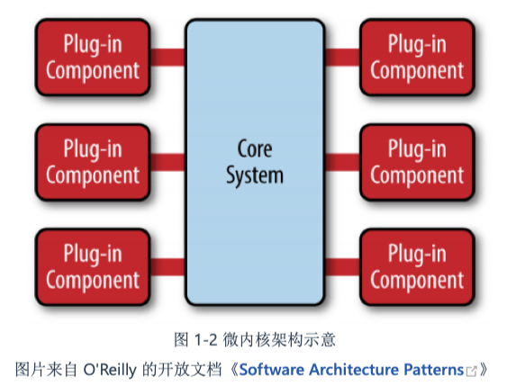
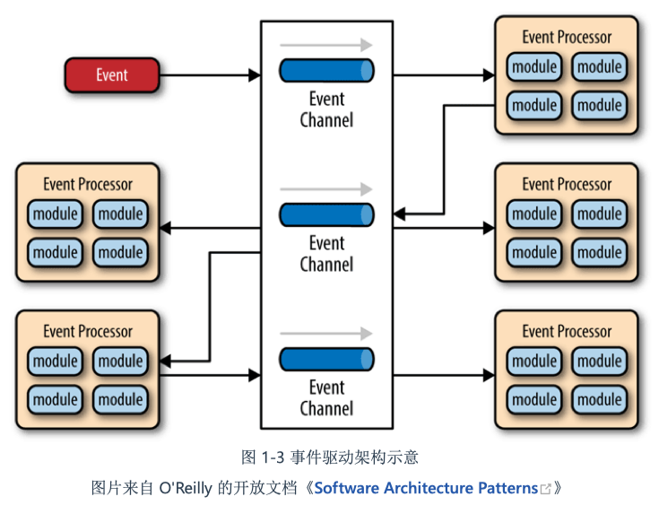
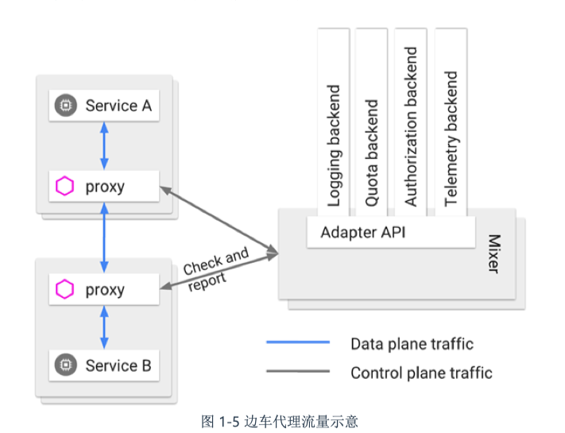

tags:: 凤凰架构

- 原始分布式时代
	- 保持接口与实现的简单性，比系统的任何其他属性，包括准确性、一致性和完整 性，都来得更加重要
	- 硬件运算处理能力很差，所以一开始是研究分布式架构
		- 网络运算架构，rpc
		- afs文件系统
		- 服务认证和访问 控制
	- 但是远程服务在那个年代，性能还是远远比不上单机，单机本来也不快，所以开发者只能在方法本身运行时间很长，可以相对忽略远程调用成本时 的情况下才能考虑分布式
	- 将一个 系统拆分到不同的机器中运行，这样做带来的服务发现、跟踪、通信、容错、隔离、配 置、传输、数据一致性和编码复杂度等方面的问题，所付出的代价远远超过了分布式所取 得的收益。
	- 某个功能能够进行分布式，并不意味着它就应该进行分布式，强行追求透明的分 布式操作，只会自寻苦果
	- 出路
		- 提高单机处理能力，避免分布式带来的问题
		- 找到更完美的解决方案
- 单体系统时代
	- 单体系统的 不足，必须基于软件的性能需求超过了单机，软件的开发人员规模明显超过了“2 Pizza Tea m ”范畴的前提下才有讨论的价值
	- 在“拆分”这方面，单体系统的真正缺陷不在如何拆分，而在拆分之后的隔离与自治能力上 的欠缺
		- 譬如内存泄漏、线程爆炸、阻塞、死循环等问题，都 将会影响整个程序，而不仅仅是影响某一个功能、模块本身的正常运作。如果消耗的是某 些更高层次的公共资源，譬如端口号或者数据库连接池泄漏，影响还将会波及整台机器， 甚至是集群中其他单体副本的正常工作。
		- 没有办法做到单独停止、更新、升级某一部分代码
		- 缺点
			- 难以阻断错误传播
			- 不便于动态更新程序意外
			- 技术异构困难
- SOA时代-面向服务架构
	- 大的单体系统拆分成若干个更小的，不运行在同一个进程的独立服务
	- 三个比较有代表性的架构模式
		- 烟囱式 完全不合其他相关信息系统进行互相操作或协调工作，但是其实很难完全没有交互
		- 微内核架构 插件式架构，将公共服务放到一个核心里，具体业务系统以插件模块的形式提供服务适合追安引用程序
			- 
		- 事件驱动架构
			- 子系统之间建立一套事件队列管道，将外部消息放到管理里，子系统获取能处理的事件消息
			- 
		- 为啥不行了
			- 过于严格的规范定义带来过度的复杂性。而构建在 SOAP 基础之上的 ESB、BPM、SCA、S DO 等诸多上层建筑，进一步加剧了这种复杂性。开发信息系统毕竟不是作八股文章，过 于精密的流程和理论也需要懂得复杂概念的专业人员才能够驾驭。
	- 微服务时代
		- 微服务是一种通过多个小型服务组合来构建单个应用的架构风格，这些服务围绕业 务能力而非特定的技术标准来构建。各个服务可以采用不同的编程语言，不同的数 据存储技术，运行在不同的进程之中。服务采取轻量级的通信机制和自动化的部署 机制实现通信与运维。
		- 核心业务与技术特征
			- 围绕业务能力构建
			- 分散治理
			- 通过服务来实现独立自治的组件 通过远程调用来提供功 能。
			- 产品化思维 要求开发团队中每个人都具有产品化思维，关心整个产品的全部方面是具有可行 性的。
			- 数据去中心化 数据应该按领 域分散管理、更新、维护、存储
			- 强终端弱管道
				- 如 果服务需要上面的额外通信能力，就应该在服务自己的 Endpoint 上解决，而不是在通 信管道上一揽子处理。微服务提倡类似于经典 UNIX 过滤器那样简单直接的通信方式，R ESTful 风格的通信在微服务中会是更加合适的选择。
				- 不在管道上处理，而是在服务上处理
			- 容错性
			- 演进式设计
			- 基础设施自动化
				- 用微服务的团队更加依赖于基础设施的自动化，人工是很难支 撑成百上千乃至成千上万级别的服务的。
				- 对架构设计不友好，要权衡利弊的话，如果知识面不广，就难以权衡利弊
- 后微服务时代
	- 
- 无服务时代
	- 也许“不分布 式”的云端系统这条路的起点。
	- 后段设施
		- 数据库、消息队列、日志、存储等一类用于支撑业务逻辑运行，但是本身没有业务含义的技术组件
	- 函数
		- 业务逻辑代码，函数的概念与粒度，都已经很接近于程序编码角度的函数
	- 后端的技术组件 是现成的，可以直接取用，没有采购、版权和选型的烦恼；不需要考虑如何部署，部署过 程完全是托管到云端的，工作由云端自动完成；不需要考虑算力，有整个数据中心支撑， 算力可以认为是无限的；也不需要操心运维，维护系统持续平稳运行是云计算服务商的责 任而不再是开发者的责任。在 UC Berkeley 的论文中，把无服务架构下开发者不再关心这 些技术层面的细节，类比成当年软件开发从汇编语言踏进高级语言的发展过程，开发者可 以不去关注寄存器、信号、中断等与机器底层相关的细节，从而令生产力得到极大地解 放。
	- 对于那些信 息管理系统、网络游戏等应用，又或者说所有具有业务逻辑复杂，依赖服务端状态，响应 速度要求较高，需要长链接等这些特征的应用，至少目前是相对并不适合的。
	- 函数不会一直以活动状态常驻服务器，请求到了才会开始 运行，这导致了函数不便依赖服务端状态，也导致了函数会有冷启动时间，响应的性能不 可能太好（
-