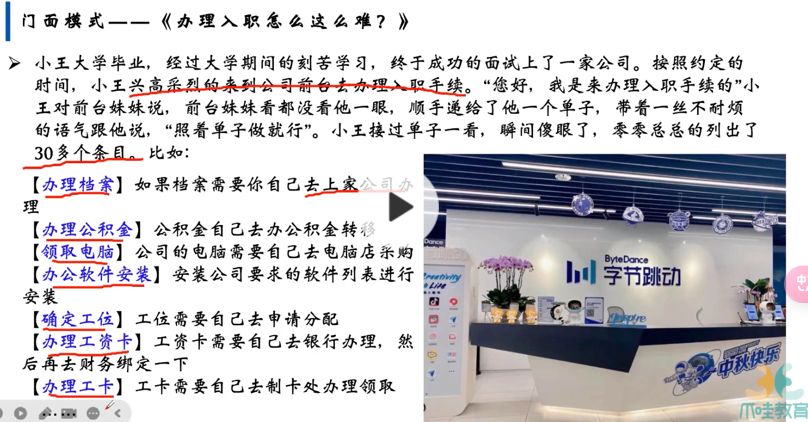
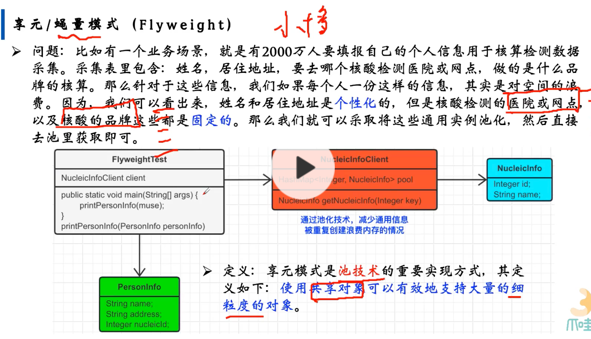
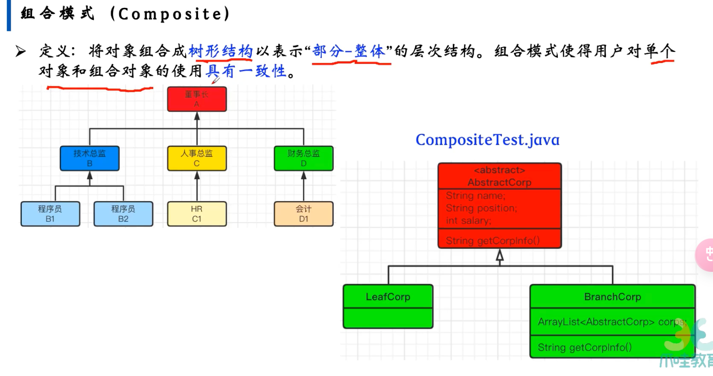
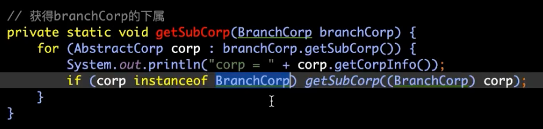

- 门面
	- 
	- 提供了一个统一的接口，用来访问子系统中的一群接口
	- 高层接口，让子系统更容易使用
	- 比如点击发动汽车，里面就能帮你 发动引擎，车门上锁，中控显示等一系列操作
- 享元模式
	- 业务场景
		- 量级很大，但是每个的数据很小
		- 
		- 姓名天差地别但是去的网店和医院都是一个，不需要存储多份，使用一个引用就行
		- 常量池那种？
- 组合模式
	- 
	- 庞大的组织结构里，如何定义不同的角色
	- 在不同的角色里，虽然有一些细微的差别，但是其实也是可以抽象出来共性，比如只分为领导和非领导，其他的也就是名称的区别
	- 树形结构
		- 
		-