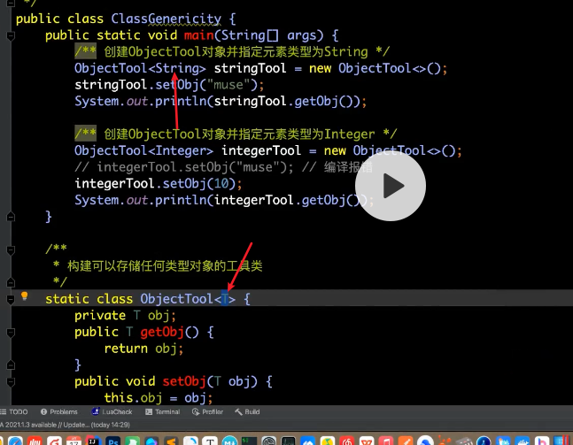
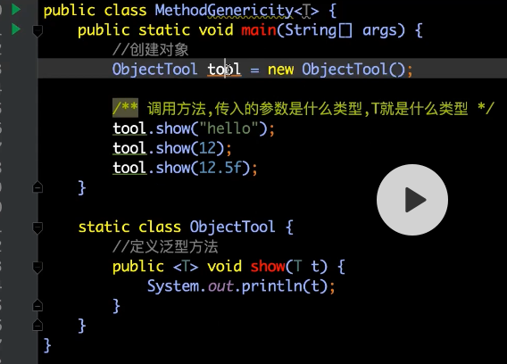
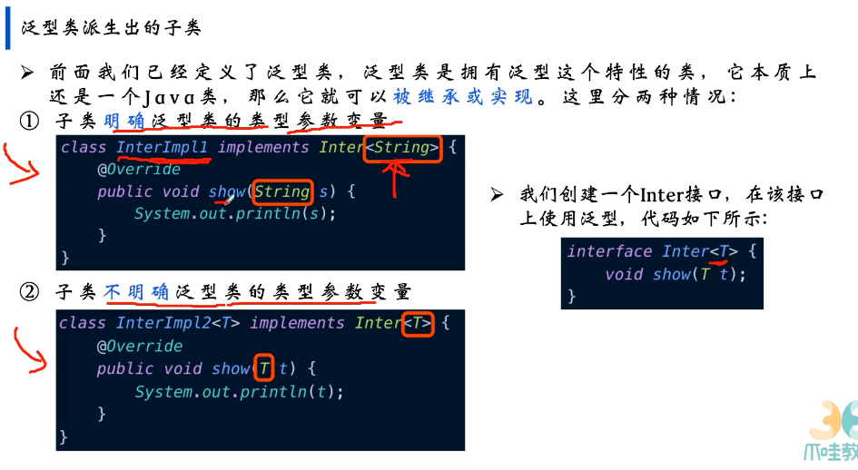
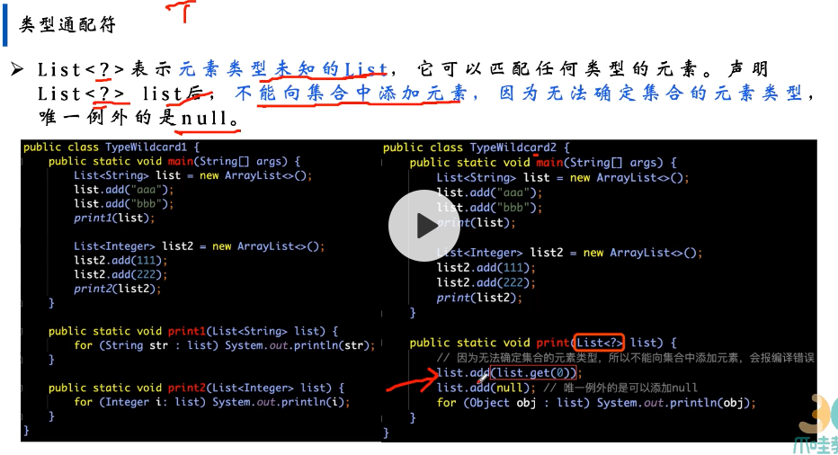
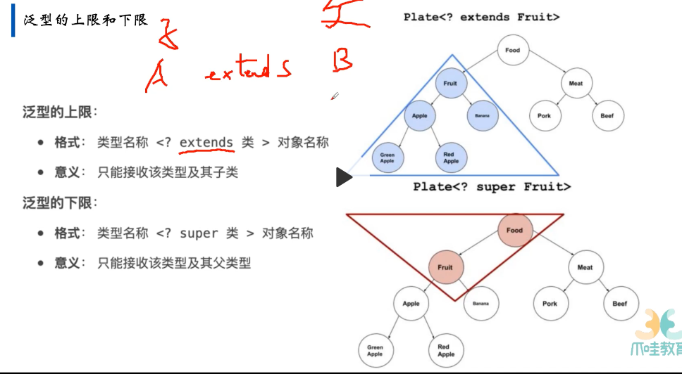
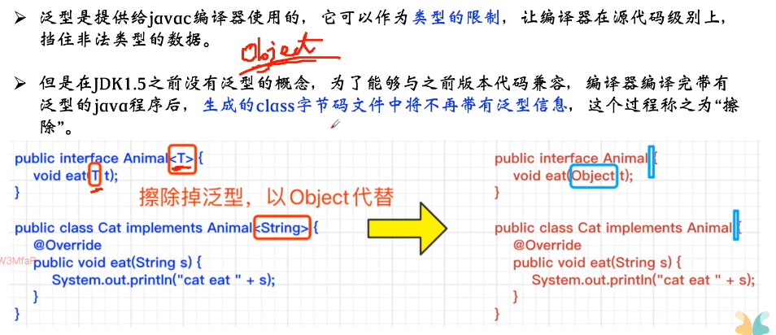
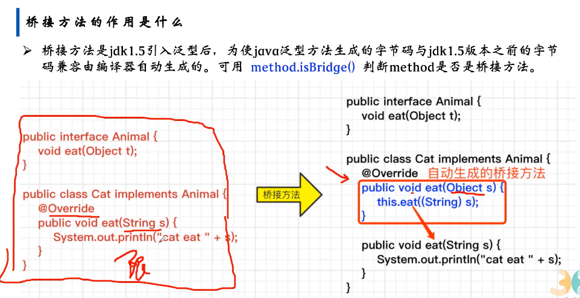

- 泛型定义在类上，具体使用类的时候，才能把类型明确下来 - 声明这个类的时候
	- 
- 方法层面去定义，不涉及到类，在调用方法的时候，传入的参数是什么类型，T就是什么类型
	- 
- 子类的继承关系
	- 
- 类型通配符
	- 
- 泛型的上限和下限
	- 
	- 上限是接收A类及其子类，可以安全的进行读取因为都可以当作A类来处理，但是不能往集合中添加任何具体的元素
- 类型擦除
	- 
	- 
	- 强转的时候就会限制住
	- 在1.5之前没有泛型的概念，当有了泛型之后，为了兼容之前的版本，因为不识别T这种东西，就用object来代替，但是如果都擦除了就没有这个限制了，所以就会由编译器自己生成一个桥接方法，用强制类型转换的方式来进行限制