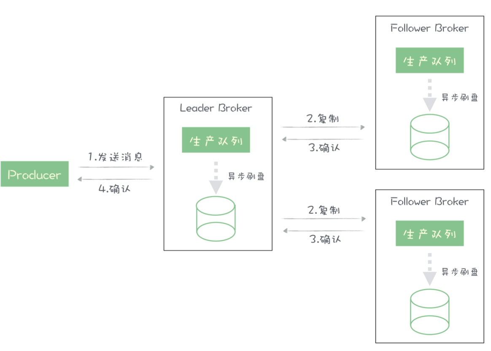
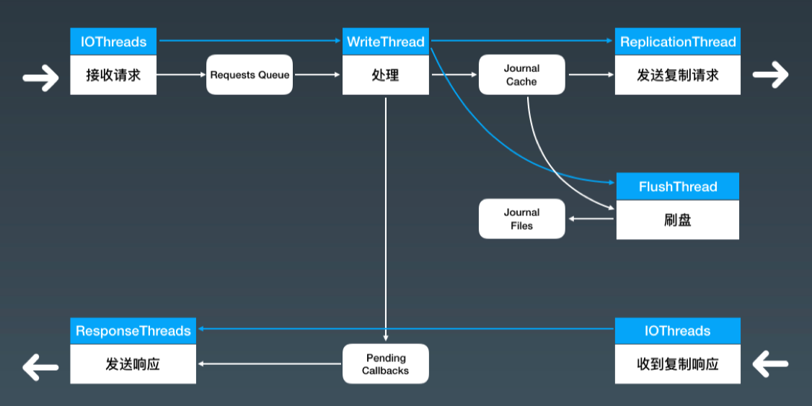

tags:: 消息队列， jmq

- 消息队列的broker，最核心的两个流程：接收生产者发来的消息，给消费者发送消息
- 影响消息队列性能的关键是消息生产的这个流程。经过优化，JMQ每秒可以处理超过100万次请求
- 
	- 生产者发送一批消息给 Broker 的主节点
	- Broker 收到消息之后，会对消息做一系列的解析、检查等处理
	- 然后，把消息复制给所有的 Broker 从节点，并且需要把消息写入到磁盘中
	- 主节点收到**大多数从节点**的复制成功确认后，给生产者回响应告知消息发送成功。
	- 这个流程里没有用任何一部框架，而是自行设计一组相互配合的处理线程来实现。
		- 
		- broker收到生产者的发消息请求后，在一个handler里处理这些请求，Nettry的IO线程
		- 收到请求后，在Handler中不做过多的处理，执行必要的检查后，将请求放到一个内存队列里，requests queue里。放到内存队列里之后，handler方法就结束了，没有太多的业务逻辑，所以执行过程很快，即使处理海量请求，也不会过多占用IO线程
		- 因为要保证消息有序性，整个流程的大部分过程不能并发，只能单线程执行。用writeThread从请求队列里安顺序获取请求，进行解析请求等其他处理逻辑，将消息序列化并写到存储里。序列化的消息写到一个内存缓存里，journalCache，等待后续处理
		- 执行到这里，消息已经被转换成一个连续的字节流，每个消息在字节流里都有一个全局唯一起止位置，offset。后续处理了不需要关心字节流里的内容，只要确保字节流能快速正确的被保存和复制就行
		- 还有需要给生产者回响应，但是这时候，消息还没有落盘，也没有完成复制，不能给生产者响应，把待返回的响应安顺序放到内存的链表pending callbacks中，记录每个请求中的消息对应的offset
		- 有2个线程，flushthread，replication thread，这两个线程是并行的，分别负责批量异步进行刷盘和复制。刷盘不停地把新写入的journal cache字节流写到磁盘上，完成一批数据的刷盘，会更新一个刷盘位置的内存变量，这时候，这个刷盘位置执勤啊的数据已经安全写到磁盘里。复制线程也差不多，维护一个复制位置的内存变量
		- 设计了专门发送响应的线程reponseThreads，刷盘位置或复制位置更新后，检查待返回的响应链表pending callbacks，根据QOS级别的设置（消息成功的定义，有的是消息写到磁盘里才算成功，有的是复制完成算成功）
		- 将刷盘位置或者复制位置之前所有响应，以及已经超时的响应，利用 这组线程 ReponseThreads 异步并行的发送给各个客户端。
		- 整个流程中，除了 JournalCache 的加载和卸载需要对文 件加锁以外，没有用到其他的锁。每个小流程都不会等待其他流程的共享资源，也就不用互 相等待资源（没有数据需要处理时等待上游流程提供数据的情况除外），并且只要有数据就 能第一时间处理。
		- 最核心的部分在于 WriteThread 执行处理的这个步骤，对每条消息进行处理 的这些业务逻辑，都只能在 WriteThread 中单线程执行，虽然这里面干了很多的事儿，但 是我们确保这些逻辑中，没有缓慢的磁盘和网络 IO，也没有使用任何的锁来等待资源，全 部都是内存操作，这样即使单线程可以非常快速地执行所有的业务逻辑。
	- 优化
		- 一是我们使用异步设计，把刷盘和复制这两部分比较慢的操作从这个流程中分离出去异步 执行；
		- 第二是，我们使用了一个写缓存 Journal Cache 将一个写磁盘的操作，转换成了一个写 内存的操作，来提升数据写入的性能，关于如何使用缓存，后面我会专门用一节课来讲；
		- 第三是，这个处理的全流程是近乎无锁的设计，避免了线程因为等待锁导致的阻塞；
		- 第四是，我们把回复响应这个需要等待资源的操作，也异步放到其他的线程中去执行。