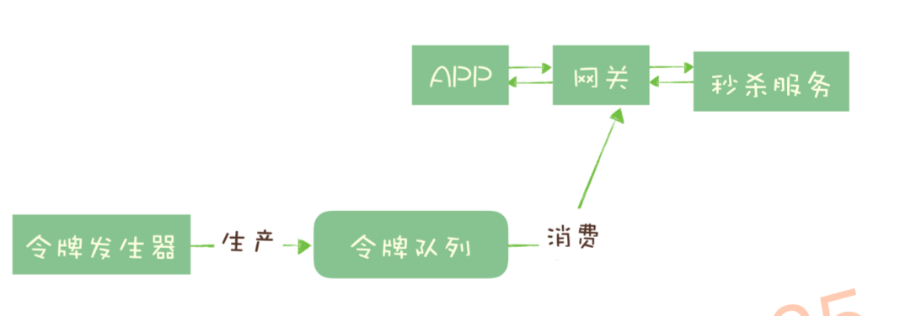

tags:: 消息队列，mq

- 最主要：收发消息。应用之间的通信
- 哪些问题适合用消息队列解决
	- 异步处理。
		- 如何设计一个秒杀系统。
			- 需要解决的问题：用有限的服务器资源，尽可能处理短时间的海量请求。
			- 秒杀包含：风险控制，库存锁定，生成订单，短信通知，更新统计数据。
			- 重要的只是风险控制，锁定库存。就可以给用户返回秒杀结果，后面三部慢慢处理就行。放到消息队列里，异步进行后续操作
			- 
			- 可以让秒杀的响应速度更快，大量的服务器资源来处理秒杀请求。
		- 服务的异步处理，好处：
			- 更快的返回结果
			- 减少等待，步骤间的并发，提高系统总体的性能。
	- 流量控制
		- 过多的请求会压垮秒杀系统。
		- 海量的请求下，在自身能力范围内尽可能多处理请求，拒绝处理不了的请求。
		- 请求打进来，进了网关，就进消息队列，进行流量控制保护后端服务。
			- 
		- 超时的请求可以直接丢弃，将超时无响应的请求处理成秒杀失败。
		- 好处：
			- 根据下游的处理能力自动调节流量，达到消峰填谷的作用
		- 代价：
			- 增加系统调用链环节，让总体的响应时延变长
			- 上下游系统将同步调佣改成异步消息，增加系统复杂度
		- 更简单的流量控制方式：
			- 消息队列实现一个令牌桶。单位时间内只发放固定数量令牌到令牌桶，规定服务在处理请求前要从令牌桶里拿个令牌才能处理，如果令牌桶里没有令牌了，就拒绝请求了。能保证固定时间只能请求这么多的数据。
			- 
			- 用一个固定容量的消息队列+一个令牌发生器实现。令牌发生器根据预估的处理能力，匀速生成令牌放到令牌队列（队列满了就丢掉），网关在收到请求的时候去令牌队列里消费令牌。
	- 服务解耦
		- 订单创建的时候，支付系统需要发起支付流程，风控系统需要审核，客服要发短信等等。
		- 下游系统不断增加，下游系统可能只需要其中的一个子集，订单服务需要修改订单系统和下游系统的接口。
		- 发到消息队列里，下游服务订阅主题，都能获得完整实时的订单数据。
	- 发布，订阅系统实现一个微服务级系统间的观察者模式？？？？？
	- 连接流计算任务的数据？？？？？
	- 将消息广播给大量接受者
- 问题
	- 消息队列会带来延迟（都是队列里堆着呢
	- 增加系统复杂度
	- 数据不一致问题
- 能处理几十万tps级别的性能
- 计数准确的实现，redis的INCR命令来计数，能保证原子性。如果redis性能达不到，就用kafka+flink集群
-
- 服务降级（流量控制）
- 分布式服务之间进程的通信
- 通过mq的重试，还可以保证分布式事务的一致性（比如说数据库和缓存之间的最终一致性问题
- 上下游的处理速度不一致的时候，可以把数据存储起来，进行处理。生产者消费者？ 通信过程中的缓存的作用
- 处理异步请求
- binlog做数据同步，不过要严格注意顺序问题
-
-
- TODO 令牌桶是怎么实现呢？代码层面。
- TODO 作为发布 / 订阅系统实现一个微服务级系统间的观察者模式 啥意思，消息队列？
- TODO 连接流计算任务的数据？？？？ 消息队列
- TODO 观察者模式
- TODO flink？
- TODO jmq是怎么保证数据的顺序问题的呢?不是有很多bocker吗？bocker是啥？
-
-