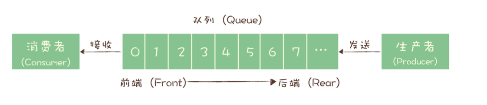
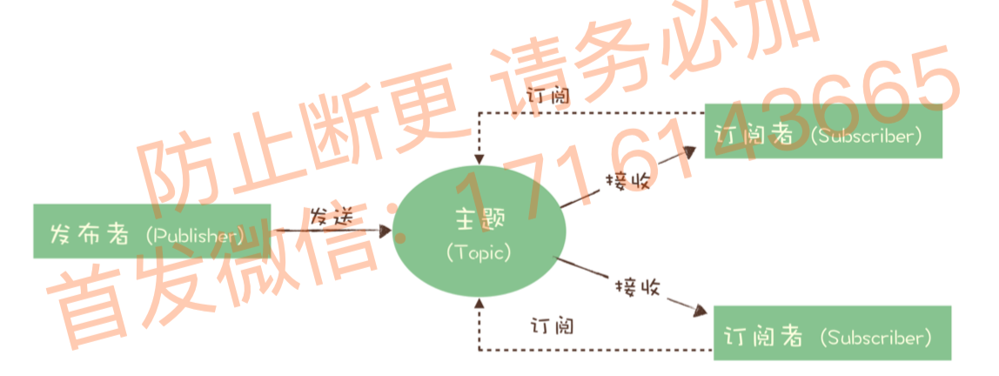
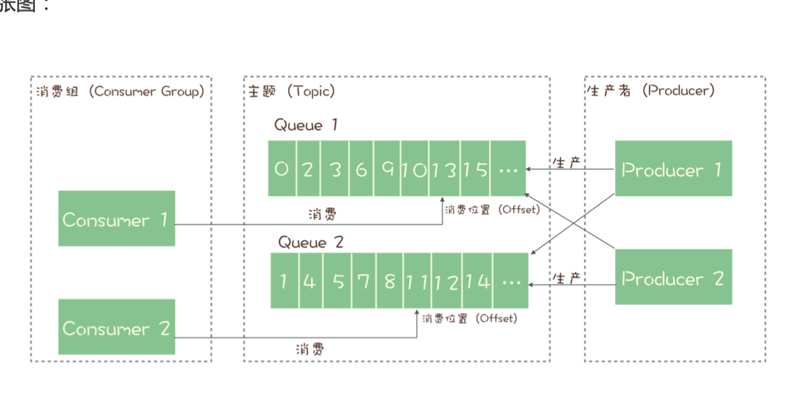

tags:: 消息队列，mq，topic

- 队列 queue，主题 topic，分区 partition
- 消息队列演进
	- 最初的消息队列，就是严格意义上的队列
		- 
		- 这时候多个生产者往队列里放消息，顺序就是发送的顺序。多个消费者接收，就只能接受到中间的某一部分。一个消息可能被其中一个消费者收到。如果每个消费者都想收到全量数据，那就要为每个消费者创建一个单独队列，发送者在某个队列里都放一个。但是是比较蠢的，因为复制到多个队列会浪费资源，生产者还需要知道有多少个消费者，没有解耦
	- 演化出了“发布-订阅模型”
		- 
		- 发送方叫publisher，接收方叫subscriber，存消息的容器是主题topic
		- 发布者发消息发到topic里，订阅者接收消息之前要先订阅主题。订阅是一个动作，也是主题在消费时的一个逻辑副本。
		- 如果只有一个订阅者，其实和队列模型基本就一样了，可以兼容队列模型。
		- 现代队列产品消息模型一般都是这种发布-订阅模型
- RabbitMQ消息模型
	- 用的队列模型。那咋解决多个消费者呢？它有个exchange模块，生产者把消息放到exchang模块，exchange根据自己配置的策略将消息投递到哪些队列里，配置exchange让把消息发送到多个队列上，每个队列都是全量数据（不是说这种很蠢吗？数据还是重复了，只是通过exchange解耦了
- RocketMQ消息模型
	- 用的发布订阅模型
	- Queue概念的引入背景
		- 所有消息用的都是请求-确认机制来确保消息不会在传递过程中由于网络或服务器故障丢失。
			- 生产端，生产者把消息发给服务端(broker)，服务端收到消息写到主题或队列里，发给生产者确认的响应，如果没收到响应，生产者重新发消息
			- 消费端，消费者收到消息完成逻辑，会发送消息确认消息，否则服务端会重新发消息，直到消息成功确认。
			- 会有问题，为了确保消息的有序性，一条消息被成功消费之前，下一条消息不能消费，否则就不有序了。
			- 会导致，主题在任何时刻，只能有一个消费者实例消费，那就没法水平扩展消费者数量来提高总体的消费性能
	- 为了解决上述问题，增加队列概念。每个主题有多个队列，多个队列实现多实例并行生产消费
	- RocketMQ 只在队列上保证消息的有序性，主题层面是无法保证消息的严格顺序的。
	- {:height 294, :width 572}
	- 哦是的，多个queue实现并行，会保证有先后顺序的消息都放在一个queue里，queue里的消息时严格有序的。这样有几个队列，就有几个消费者能并行（怎么保证先后顺序的放一个queue呢？
	- 每个队列在每个消费组上都会去维护一个消费位点，记录消费组在队列上消费到哪里了
- kafka消息模型
	- 和rocketMQ完全一样。是业务模型，底层的视线不是说一样的哈！
	- 唯一区别：队列的概念在kafka叫partition
- 思考：如果不要求消息的顺序，能做到单个队列的并行消费吗？？？？其实没懂
	- 首先，因为必须要收到ack才能发下一条，那要把消息队列先进先出改成数组随机访问
	- 用offset来 控制消息组具体要消费哪条消息，mq不主动删除消息，消息有过期时间，如果到了过期时 间，只能确认不能重新该消费，只保留最大可设置天数的消息。超过该天数则删除，还要 维护客户端确认信息，如果有客户端没确认，需要有重发机制。
- 补充：
	- consumer和queue不是强关联，任何时刻，某个queue只能被一个consumer占用
		- A跑过来占用了queue1，后面B跑过来消费queue1，好像只需要保证消费queue1里的数据是顺序的就行
	- producer和queue也不是强关联的，发到哪个queue里都行，只要保证同一个消息会打到同一个queue里。默认策略是轮询选择每个queue
-
-
-
-
- QA：
	- 每个消费组都有一个自己的消费位点（这个消费位点的判定，因为在queue里的消费是跳跃的，怎么解决这个问题呢？
		- 每个队列在每个消费组上都会去维护一个消费位点，记录消费组在队列上消费到哪里了
	- 一条消息按照什么规则切到一个队列里？
		- 订单ID或者用户ID，用一致性哈希算法，计算出队列ID，发到同一个队列上
	- 有异常情况咋办？
		- 超时之前阻塞，超时之后解除锁定，允许其他消费者来拉消息，消费位置没变，其他消费者来队列里拉消息，返回的还是之前那一条
-
- TODO 大概是如果按照什么切分键切到一个队列里，一条消息的，这个规则咋配置的？
- TODO 每个消费组都有一个自己的消费位点（这个消费位点的判定，因为在queue里的消费是跳跃的，怎么解决这个问题呢？？？？
- TODO 我们这个并行数是开多个queue吗？
-
-
-
-
-
- TODO 消息空洞
-