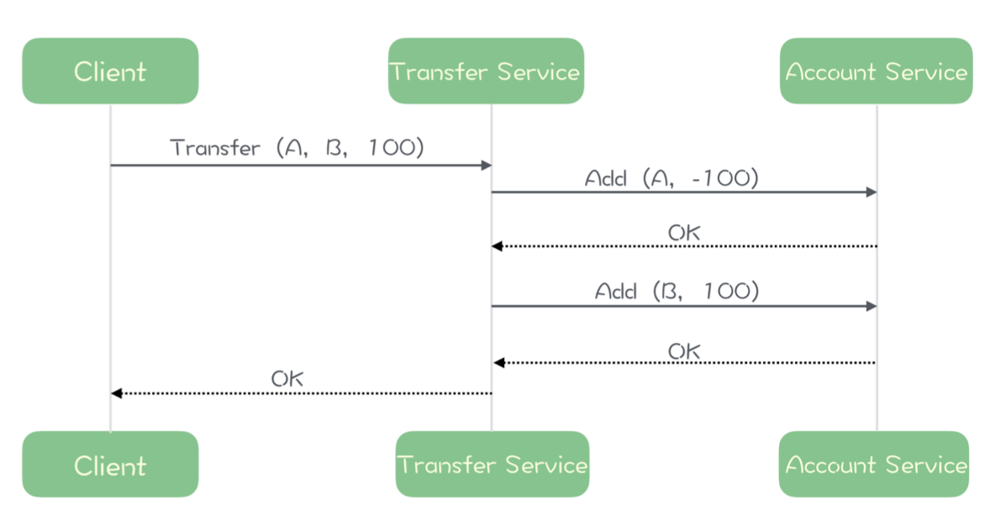

tags:: 消息队列，异步

- 异步是程序设计的思想，用异步模式设计的程序可以减少线程等待，在高吞吐量场景中，极大提升系统整体性能，显著降低时延
- 异步设计如何提升系统性能
	- 
	- 假设add方法平均响应时延是50ms，那这个服务大概一次请求的时延是100ms。每次请求占用一个线程。
	- 每个线程每秒处理10个请求。假设一台服务器每秒钟可以处理请求上线是1万个线程*每秒10个请求=10个请求
	- 如果速度超过这个值，不能马上处理，只能阻塞或排队。这时候时延就会变成排队的等待时间+处理的时间。
	- 但是这个时候，cpu、内存、网卡流量或磁盘的IO都很空闲。因为线程基本上都在等待add服务返回结果。
- 异步实现解决等待问题
	- 
	- 
	- 不需要等待account服务返回结果之后，只需要个位数量的线程，一样可以实现同步场景大量线程一样的吞吐量。
	- 总体吞吐量会大大超过同步实现，在服务器CPU、网络带宽资源达到极限之前，响应时延不会随着请求增加而显著升高。
- 简单实用的异步框架 CompletableFuture
	- 服务端框架
		- 
	- 客户端使用
		- 
		- 在调用异步方法获得返回值 CompletableFuture 对象后，调用 CompletableFuture 的 get 方法，像调用同步方法那样等待调用的方法执行结束并获得返 回值
		- 也可以像异步回调的方式一样，调用 CompletableFuture 那些以 then 开头的一系 列方法，为 CompletableFuture 定义异步方法结束之后的后续操作。比如像上面这个例子 中，我们调用 thenRun() 方法，参数就是将转账完成打印在控台上这个操作，这样就可以 实现在转账完成后，在控制台打印“转账完成！”了。
- 异步思想
	- 当我们要执行一项比较耗时的操作时，不去等待操作结束，而是 给这个操作一个命令：“当操作完成后，接下来去执行什么。”
	- 相比于同步实现，异步实现的复杂度要大很多，代 码的可读性和可维护性都会显著的下降。虽然使用一些异步编程框架会在一定程度上简化异 步开发，但是并不能解决异步模型高复杂度的问题。
	- 只有在消息队列这种业务逻辑简单并需要超高吞吐量的场景下，或者需要长时间等待资源的地方，才考虑用异步模型。
- 如何处理失败
	- 回调的时候返回失败，如果是第一次账户服务失败了，那直接返回失败。第二次失败了，可以重试下再救救，要是救不回来了，还需要把第一次的结果回滚回去。
	- 异常处理的时候，需要先检查再补偿，否则可能重复补偿
	- OnComplete()在什么线程中运行。咋样控制回调方法的执行线程数
		- 用个线程池？或者队列