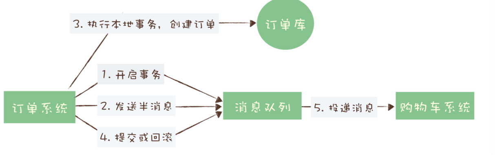
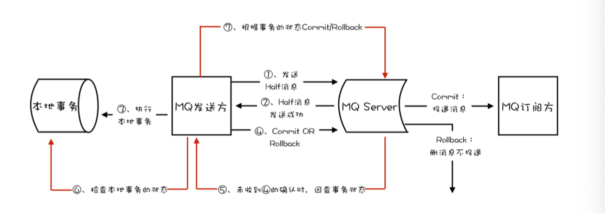

tags:: 消息队列，mq，事务消息，分布式事务

- 消息队列里的事务：解决消息生产者和消息消费者的数据一致性问题
- 例子：
	- 下单后，创建订单
	- 使用消息队列发消息给购物车系统删除已下单商品
	- 可能出现的问题：
		- 创建了订单，没有清理购物车。 这个可以让购物车清理成功之后再给服务端抱回消费确认就行，要是失败了可以通过消息队列来自动重试
		- 订单创建失败了，购物车里商品清掉了。要解决的问题。要保证创建订单和发送消息这两个步骤的一致性
- 分布式事务
	- 分布式事务实现 二阶段提交，TCC和事务消息
	- 事务消息适用场景：异步更新数据，对数据实时性要求不太高的场景。创建订单后，出现短暂几秒购物车商品没有被清空也行。
- 消息队列如何实现分布式事务
	- 事务消息需要消息队列提供相应的功能才能实现。kafka和rocketMQ都提供事务相关功能。
	- 
	- 订单系统在消息队列上开启一个事务，发送”半消息“，消息完整的，但是在事务提交之前，对于消费者来说，消息不可见。
	- 半消息发送成功后，去做本地事务，根据本地事务执行结果进行提交或回滚事务消息。
	- 第4步提交的时候，如果失败了。kafka直接跑出异常。业务代码里也可以重复提交，直到提交成功。
	- RocketMQ的分布式事务实现
		- 订单系统，提交或回滚事务消息时发生网络异常，broker没有收到提交或回滚请求，会定期反查本地事务状态接口，根据反查的结果来决定对事务的操作。
		- 需要业务代码自己提供一个反查本地事务状态的接口。比如：根据订单ID在订单库里查询订单是否存在
		- 
	- 有没有完整实现事务ACID特性。
	- atomic：原子性，也没有，没有同时失败同时成功
	- consistency：一致性 只能保持最终一致性，可能中间会有不一致的过程
	- isolate：隔离性 也不隔离
	- duration：持久性 可以
- QA：
	- 为啥不等订单创建成功，消息队列再发送订单数据。
		- 因为订单创建成功了，可能机器突然挂掉了，那就不能实现了
	- seata里的消息事务的实现是，记录一个数据库的事务消息表，把消息信息的快照和对业务数据的操作都作为数据库事务放到数据库里，操作成功之后，从数据库读取消息信息发给broker，发送成功之后删除数据库里的消息快照，如果不成功，利用消息队列的重试来保证最终一致性
		- 大部分事务消息适用场景，没有这样的数据库，而且通常情况，生产者消费者不能共享数据库，或者数据库性能达不到要求
	-
-
- TODO 2PC和TCC补充下