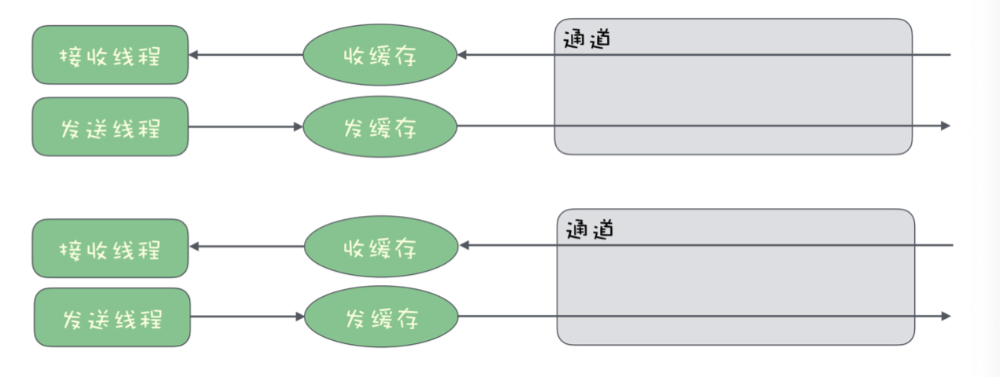
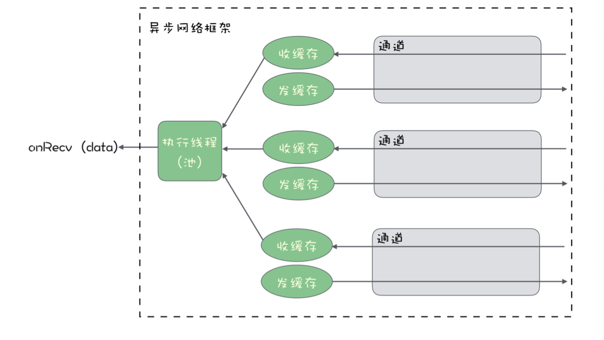
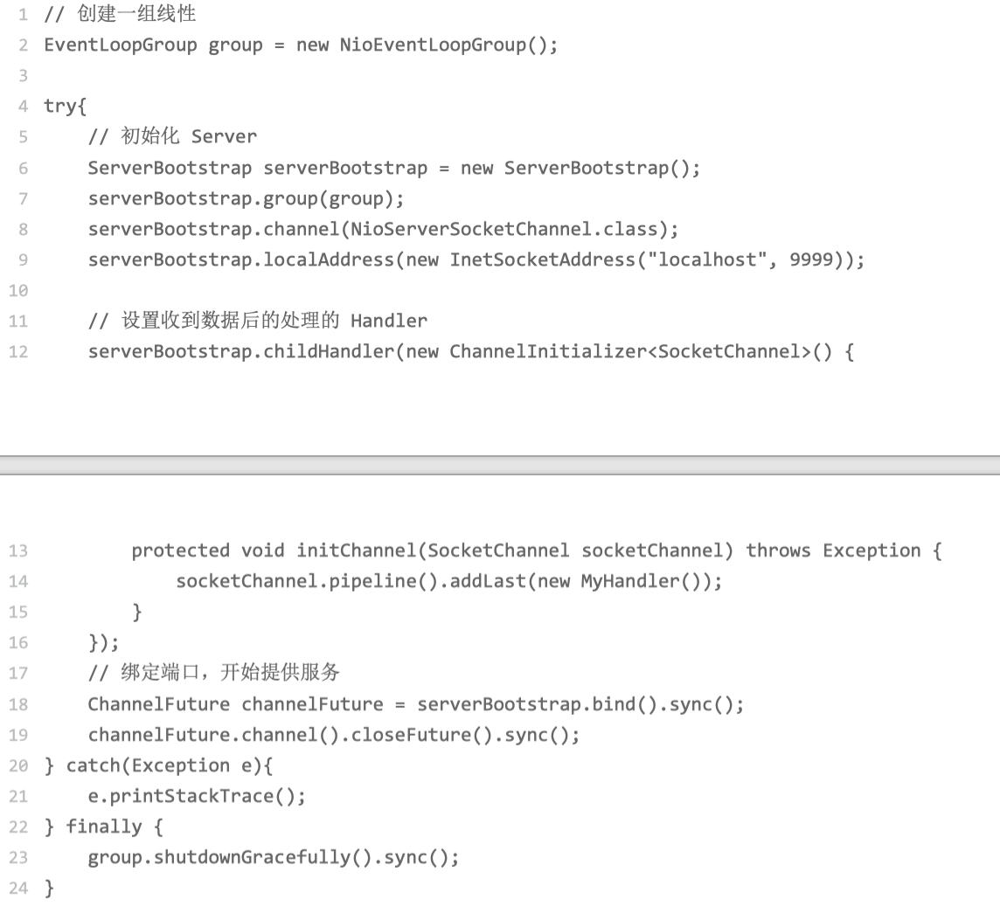
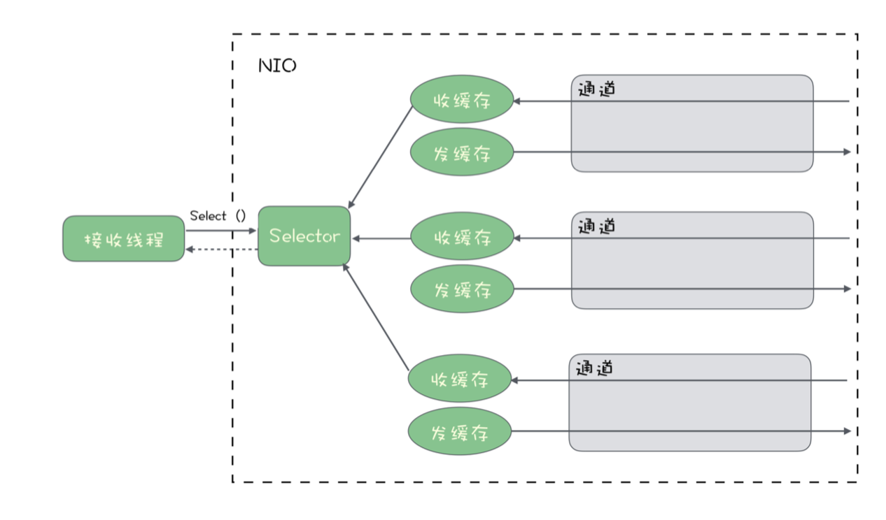

tags:: 消息队列，异步网络传输

- IO密集型系统大部分时间都在执行IO操作，IO操作包含网络IO和磁盘IO，以及与计算机连接的一些外围设备的访问。
- 开发的业务系统，很少有非常耗时的计算，更多的是网络收发数据，读写磁盘和数据库这些 IO 操作。这样的系统基本上都是 IO 密集型系统，特别适合 使用异步的设计来提升系统性能。
- 因为现在的SSD，磁盘读写速度越来越快，对于本地磁盘的读写，异步的意义越来越小。更加关注高性能异步网络传输
- 理想的异步框架
	- 大部分语言提供的网络通信基础类库都是同步的。
	- TCP连接建立后，用户代码会获得一个用于收发数据的通道，通道会在内存中开辟两片区域用来收发数据的缓存。
	- 发送数据：往通道里写入数据。用户代码在发送时写入的数据暂存在缓存中，操作系统通过网卡，将发送缓存中的数据传输到对端服务器上。只要缓存没有满，发送数据速度没有超过网卡传输速度的上限那就是很快的。发送数据同步发送就行
	- 同步IO模型
		- 
		- 接收数据：不知道啥时候回收到数据。用一个线程阻塞在那里等数据，有数据来，先把数据写到接收缓存，然后给接收数据的线程发个通知，收到通知之后结束等待，读取数据。然后继续阻塞等下一批数据来。
		- 少量连接的时候还行，如果有非常多的连接，每个连接都要阻塞一个线程来等待数据，每个连接都在进行数据收发的时候，会导致大量的线程抢占CPU时间，造成频繁的CPU上下文切换，导致CPU负载升高，整个系统比较慢
	- 异步IO模型
		- 
		- 实现定义好接收数据后的处理逻辑，将处理逻辑作为一个回调方法。接收数据的时候，框架自动执行这个回调方法
		- Netty实现异步网络通信
			- 
			- 1. 首先我们创建了一个 EventLoopGroup 对象，命名为 group，这个 group 对象你可 以简单把它理解为一组线程。这组线程的作用就是来执行收发数据的业务逻辑。
			- 2. 然后，使用 Netty 提供的 ServerBootstrap 来初始化一个 Socket Server，绑定到本 地 9999 端口上。
			- 3. 在真正启动服务之前，我们给 serverBootstrap 传入了一个 MyHandler 对象，这个 MyHandler 是我们自己来实现的一个类，它需要继承 Netty 提供的一个抽象类： ChannelInboundHandlerAdapter，在这个 MyHandler 里面，我们可以定义收到数 据后的处理逻辑。这个设置 Handler 的过程，就是我刚刚讲的，预先来定义回调方法 的过程。
			- 4. 最后就可以真正绑定本地端口，启动 Socket 服务了。
			- 服务启动后，有客户端请求连接，netty会自动接收并创建个socket链接。
			- 接收到来自客户端数据之后，netty会在group对象里获取一个IO线程，IO线程中调用接收数据的回调方法。
		- NIO
			- 提供selector对象，解决一个线程在多个网络连接上的多路复用问题。
			- NIO里，每个已经建立好的连接用一个channel对象表示。希望一个线程能接收来自多个channel的数据。
			- 一个线程对应多个，可能会出现
				- 线程在忙着接收连接A的数据，连接B又收到新的数据，忙不过来了
				- 所有连接没数据，线程没事儿干不确定哪个channel会在啥时候收到数据。
				- 
				- selector通过一种类似于事件机制来解决这个问题。
				- 将连接绑在selector上，接收数据的线程调用selector.select()方法等待数据到来，select方法是一个阻塞方法，线程会一直卡在这儿，直到channel中有任意一个有数据到来，就会结束等待返回数据。返回是一个迭代器，可以从迭代器获取所有channel收到的数据，执行业务逻辑。
				- 可以选择直接在这个线程里面来执行接收数据的业务逻辑，也可以将任务分发给其他的线 程来执行，如何选择完全可以由你的代码来控制。
-
-
-
- TODO NIO那个selector干嘛的
-
-
- 我咋记得IO的处理和计算的CPU不用一个来着？