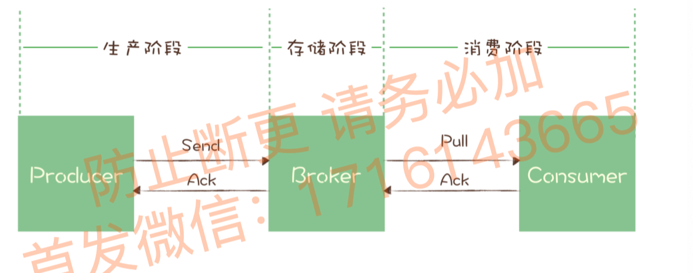

tags:: 消息队列，mq，重试

- 遇到网络中断或硬件故障，怎样保证不丢消息
- 怎么保证消息可靠传递的原理是啥？
- 怎么检测消息丢失了
	- 厉害的公司，会有分布式链路追踪系统，用追踪系统能方便追踪每条消息（咋搞的
	- low一点的实现方案
		- 消息队列是有序的，发出消息的时候就写一个连续递增的序号，在消费端检查这个序号是否连续
		- 大多数消息队列的客户端都是支持拦截器机制，可以利用拦截器，在生产者发送前将序号注入到消息里，在消费者收到消息的时候，检测消息是否连续。
		- kafka和RocketMQ，不保证消息在topic上的严格顺序，只能保证分区有序，所以发消息的时候指定分区，在每个分区单独检测消息序号连续性。
		- 如果不好协调producer间的发送顺序，需要每个生产者分别生成各自的消息序号，带上producer的标识，consumer按照不同producer来检测序号连续性
- 确保消息可靠传递
	- 阶段划分
		- 
		- 生产阶段，发送消息出去之后，如果没有收到broker发过来的确认响应消息，就会去重发，重发再失败，就会用返回值或异常的方式告知用户。
			- 只要正确处理返回值或捕获异常，就可以保证这个阶段消息不会丢失。
			- 同步发送的话，就捕获异常
			- 异步发送的话，要在回调信息里检查发送结果。
		- 存储阶段，只要broker正常运行，就不会出现丢失消息问题，如果broker进程死掉了或宕机了，就有可能丢失消息
			- 单个节点broker，如果要确保不丢，接到消息后，将消息写入磁盘再给生产者发送响应信息，即使宕机里，消息在磁盘里，可以恢复。rocketMQ里讲刷盘方式配置为sync_flush同步刷盘
			- 多节点broker集群，将消息发到2个以上的节点，再给客户端回复响应。这样其中一个宕机了，另外的顶上。（如果批量都挂了，也完蛋吧
		- 消费阶段，消费者拉取消息，执行业务逻辑成功了才会发确认响应，如果broker没收到响应，下次拉消息还是返回同一条。
			- 不要收到消息立即返回确认，要在执行完所有消费业务逻辑之后，再确认
	- 收到重复消息，咋不会影响业务逻辑性
		- 实现幂等性
		- 有个businessId，如果有重复的，就丢掉。redis里存储businessId，加个事务锁，设置超时时间。
	-