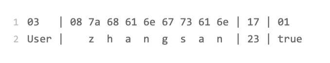

tags:: 消息队列，序列化

- 在TCP连接上，传输数据的基本形式是二进制流，也是一段一段的1和0，在一般编程语言或网络框架提供的API种，传输数据的基本形式是字节，也就是Byte。一个字节是8个二进制位，8个Bit。二进制流和字节流本质上是一样的。
- 对于编写的程序来说，通过网络传输的数据是结构化数据。一条命令，一段文本，一个结构体。
- 要通过网络框架的API传输结构化数据，需要先实现结构化的数据与字节流之间的双向转换。结构化数据转成字节流的过程叫序列化，反过来就是返学劣化。
- 序列化用途：
	- 网络传输数据
	- 将结构化数据保存在文件里，文件内保存数据也是二进制序列。海量数据场景中，将对象序列化后暂时从内存转移到磁盘里，需要用的时候将数据从磁盘中读取出来。
- 序列化实现
	- java和go语言内置了序列化实现。
	- 开源的 google的protobuf，kryo，hessian等。json，xml等标准数据格式，也可以作为一种序列化实现来使用。
	- 序列化选择因素
		- 序列化后的数据最好易于人类阅读
		- 实现复杂度高
		- 序列化，反序列化要快
		- 序列化之后的信息密度越大越好，也就是序列化之后占用的存储空间越小越好
		- 通常易于阅读和信息密度是矛盾的，实现复杂度和性能也是矛盾的
	- 各个序列化的特点
		- JSON，XML序列化方法，可读性最好，但是信息密度最低
		- kryo，hessian 使用范围广，使用简单，性能比JSON，XML好，但是不如专业的序列化实现
	- 使用场景
		- 强业务类系统，业务复杂，需求变化快，对性能要求不严格。推荐用JSON这种实现简单，数据可读性好的序列化实现。代价就是多一点CPU时间和存储空间
		- ```
		  byte[] serializedUser = JsonConvert.SerializeObject(user).getBytes("UTF-8");
		  ```
- 实现高性能的序列化和反序列化
	- 消息队列用于解决通信问题的中间件，对性能要求很高，通常的序列化达不到性能要求。
	- 不需要考虑通用性，可以固定字段的顺序，在序列化后字节不包含字段名，只要字段值。
	- 
	- 规定了按照name，age，married这个固定顺序来进行序列化。
	- 序列化方式更高效，序列化字节更少，传输速度也快。但是要为每种对象专门定义序列化和反序列化方法，实现复杂。