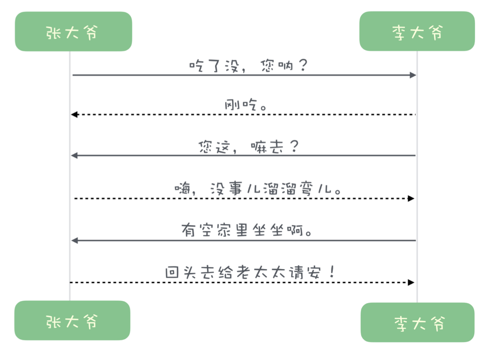
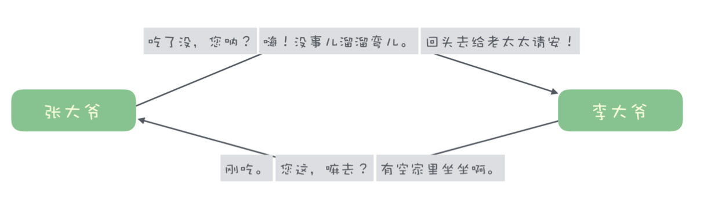
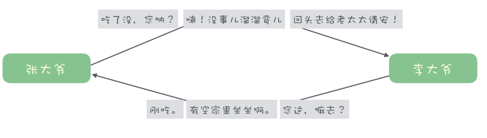
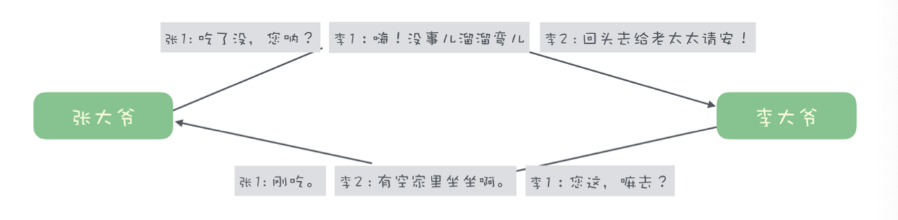

tags:: 消息队列

- 应用程序想互相通信，一起配合来实现业务功能，还要一套传输协议支持
- 传输协议是应用程序之间对话的语言。
- 如何断句
	- 传输数据的时候，首先要解决断句问题。收到数据的时候是一段一段字节。
	- 标上一个分隔符就行。很多传输协议用这个方法，如http1协议，它的分隔符换行时\r\n。但是有个问题，不论用啥字符作为分隔符，都可能出现在传输的数据中。要区分是数据内的分隔符还是真正的分隔符，就要在发送数据阶段，加上分隔符之前讲分隔符做转义，收到数据后再转义回来，比较麻烦，还损失性能
	- 在每句话前加这句话长度的数字，收到数据的时候，按照长度来读取。比分隔符方法简单很多，性能也好，是目前普遍采用的分割数据的方法
- 双工收发协议提升吞吐量
	- 单工通信：
		- 你说我听，我说你听，同时数据只能单项传输
		- http1协议就是用的单工通信，建立了一个请求后，客户端发送请求，直到服务端返回或超时，不能再发请求了。效率低，为了解决这个问题，甚至要在服务端和客户端创建多个连接
		- 但是单工通信因为是一发一收，所以有一个天然的对应关系。
		- 
	- 全双工通道，同时进行数据的双向收发，互相不影响。要提高吞吐量，应用层协议也要支持双工通信
		- 
		- 没有对应关系了，而且在多线程并发的环境下，顺序也没法保证
		- 
		- 实际设计协议的时候，一般不关心顺序，只要保证请求和响应能对上就行。
		- 加上序号！！！
		- 
		- 给发出去的请求编号，响应对方的时候，带上对方请求的编号就行。
		-