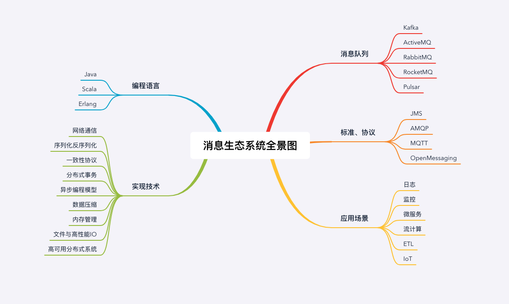

tags:: 消息队列，mq

- 消息队列：分布式系统中很多进程间的通信，都可以用消息队列解决。高性能通信，海量数据存储，高并发。
- 消息队列学习流程
	- 消息的基本概念，主题，订阅，分区
	- 掌握使用消息队列的技能，处理一些常见的问题
	- 深入源码，加深对消息队列的理解。
	- 底层技术，高性能网络传输，内存管理，锁的使用。实现事务的消息，消息队列如何支撑海量IoT设备同时在线。
- 
- 对应不同场景，选什么产品，最佳实践。
-