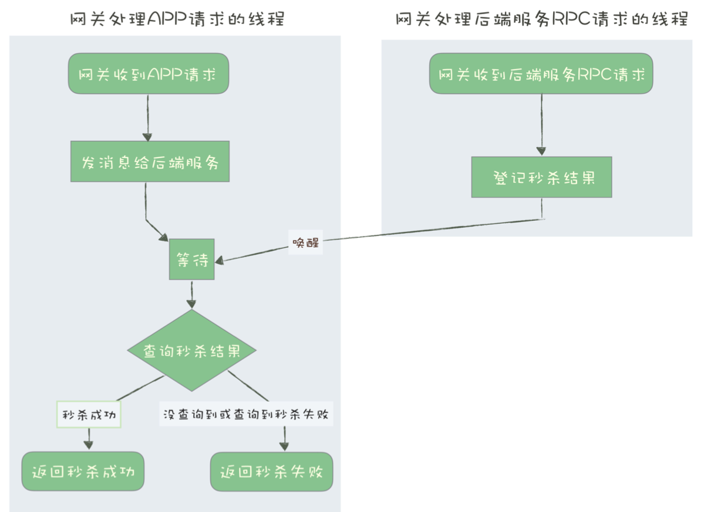
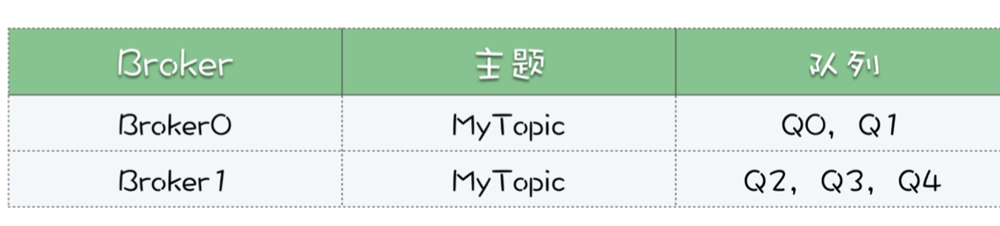

tags:: 消息队列

- 网关如何接收服务端的秒杀结果
	- 网关接收到APP秒杀请求之后，给消息队列发送消息，并且进入等待状态，等待后端服务进行相应。
	- 后端服务从消息队列里取出消息，进行处理，并将结果回调回去，唤醒网关的服务
	- 网关的服务接受到请求并请求成功，就是秒杀成功，或者等待时间到了，就是没请求到，超时了，没抢到
	- 
- 详解rocketMQ和kafka的消息模型
	- 
	-