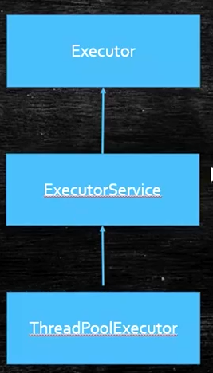
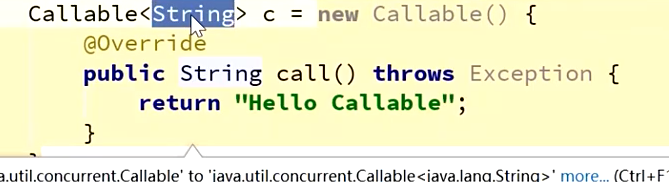
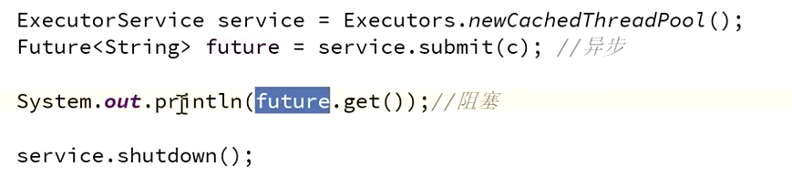
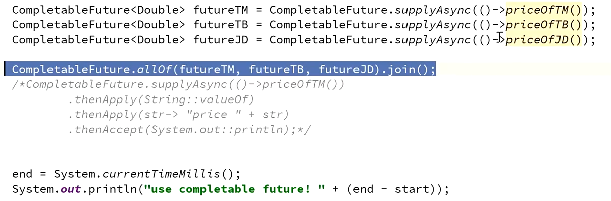
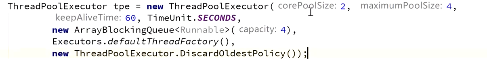
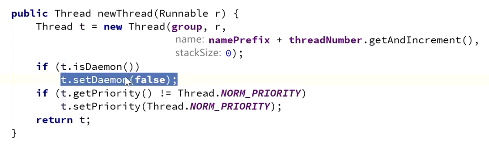

- callable和future的概念
- 
- Excutor执行者，有个execute方法，来执行runnable接口
- ExcutorService继承了Executor，除了有execute方法之外。完善了生命周期。
	- submit 提交任务，扔给线程池，让线程池来决定什么时候运行，是异步的
- Callable接口1.5之后。 callable有个返回值。可以把结果存储起来，有个结果之后返回回来通知给我
	- 
- Future
	- 
		- future.get()方法是阻塞的，当线程池里的内容返回结果回来了之后才能够拿到结果
	- FutureTask
		- 又是一个任务，又能存储一个结果。实现了runnableFuture接口，runnableFuture接口实现了Runnable接口也实现了future接口
	- CompletableFuture
		- forkJoinPool
		- 
		- 一堆任务的管理，当所有的都完成了，在执行下一步结果
		- 各种任务的管理类。如果管理一堆任务的结果
- 线程池
	- ThreadPoolExecutor
		- 继承 AbstractExectorService，线程池的执行器
		- 维护着线程的集合，任务的集合（放在任务的队列里）
		- 七个参数
			- 
			- 核心线程数  永远活着的线程数量
			- 最大线程数 线程不够了，最多能扩展到多少个
			- 生存时间  很长时间没干活了，把线程归还给操作系统。归还只能归还最大线程数-核心线程数
			- 生存时间的单位
			- 任务队列
				- ArrayBlockingQueue 限制最大大小的
				- LinkedBlockingQueue 大小最大为Integer.max_value
				- SynchronizedQueue 0个 来了任务必须来处理，不然另外一个任务进不进来
				- transferQueue 任务要被处理完了，放任务进来的线程才能走
			- 线程工厂
				- 创建线程的工厂 实现ThreadFactory newThread方法产生线程
				- 默认的
					- 
					- 指定了group和名字，方便出错的时候回溯
					- 绝不是守护线程
					- 设置成最普通的优先级，不建议设置优先级，没用
			- 拒绝策略
				- 规则，来个任务，核心线程闲着，让核心线程处理。来个任务，核心线程都忙着，放到等待队列里去。来个任务，等待队列都满了，起个新的线程（非核心线程去处理）。来个任务，最大线程数的线程都忙着，等待队列满了，执行拒绝策略
				- 拒绝策略可以自定义，jdk默认四种
					- abort 抛出异常
					- discard 扔掉，不跑异常
					- discardOldest 扔到排队时间最长的。游戏中人在走，位置信息可以丢弃最老的位置信息
					- callerRuns 调用者执行任务。谁调用了execute方法，谁执行，main线程去执行，不是同步了，但是可以完成
				- 一般用的是自定义策略。一般是把消息保存到mq或者数据库里，做好日志，什么时候有时间去执行。如果有大量任务积压，扩机器去处理。
	- ForkJoinPool
		- 分解汇总的任务
		- 用很少的线程可以执行很多的任务(子任务) TPE做不到先执行子任务
		- CPU密集型
		-