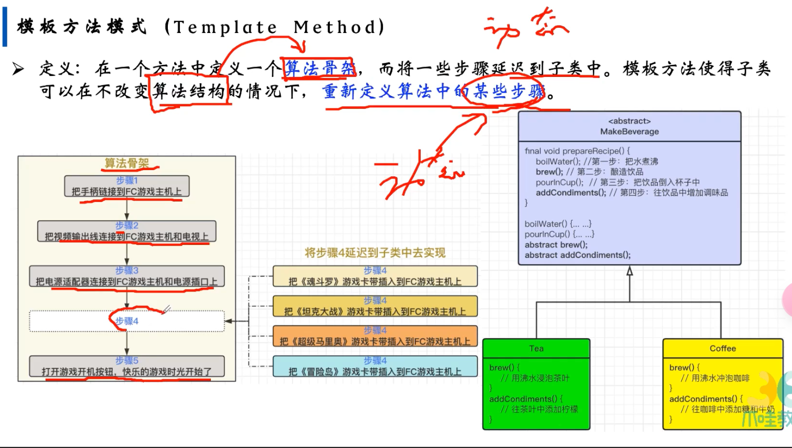
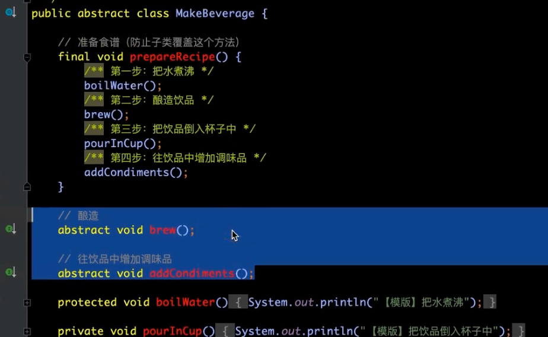
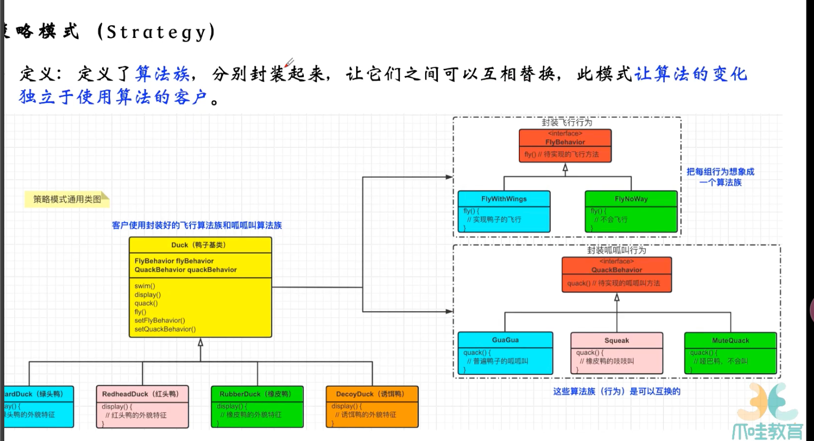
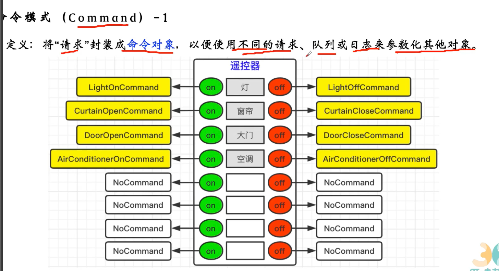
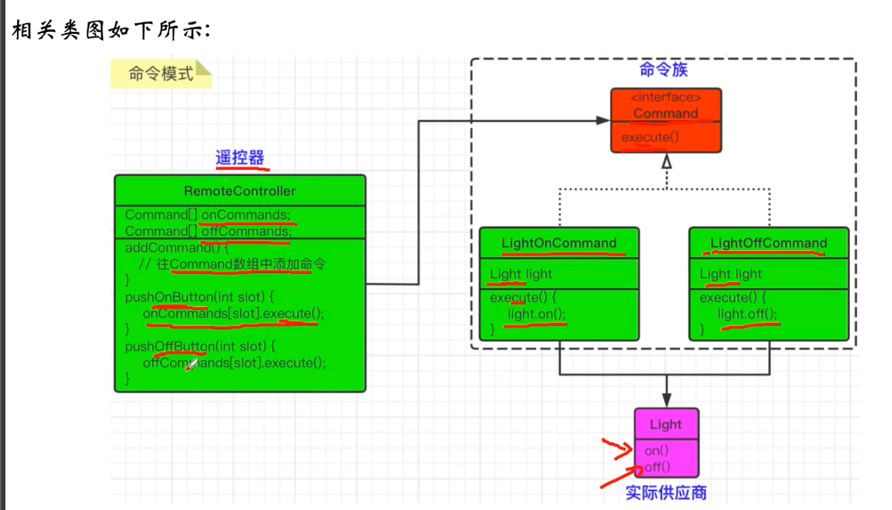

- 描述程序在运行时复杂的流程控制，多个类和对象怎样相互协作共同完成单个对象无法单独完成的任务
	- 类行为模式 继承机制
	- 对象行为模式 组合或者聚合 在对象间分配行为
- 有哪些
	- 模板方法
		- 
		- 
		-
	- 策略
		- 
		- 如果鸭子的叫声和会飞的种类，每一个都会实现以下的话，会很麻烦，因为叫声和会飞的种类可能就几种，好多小鸭子都是一种叫法
		- 把飞和叫声封装成别的对象，然后实现集中，然后不同的鸭子引用不同的对象
	- 命令
		- 
		- 
		-
	- 责任链
	- 状态
	- 观察者
	- 中介者
	- 迭代器
	- 访问者
	- 备忘录
	- 解释器