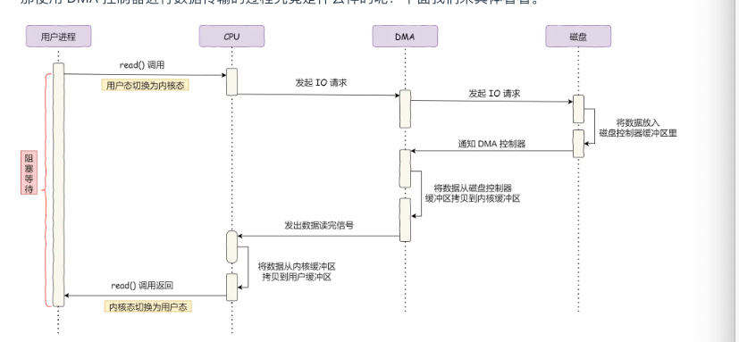

tags:: 小林网络

- DMA代表直接内存访问（Direct Memory Access）。它是一种计算机系统功能，允许某些硬件子系统直接访问主内存（RAM），而无需通过CPU进行数据传输。
- DMA出现之前的io过程
	- 
	- 过程
		- cpu发出指令之后，磁盘控制器把数据放到磁盘控制器缓冲区里
		- 准备好了，发起IO中断信号
		- CPU收到中断，把数据从磁盘控制器缓冲区里 一个字节一个字节的读到寄存器里
		- CPU把寄存器数据写到内存
	- 传统的数据传输需要CPU介入，数据从输入/输出设备传输到CPU，然后再从CPU传输到内存。这种方式在大量数据传输时会占用大量的CPU资源，因为CPU需要处理每个数据字节的传输。
	  id:: 65daafe7-24c7-4226-aebc-10da096a2f89
- DMA
	- 释放CPU，加入了DMA控制器，CPU只负责发送请求，中间的事情DMA控制器来
	- 
	- DMA的工作原理是，它使用DMA控制器，这是一个专门的硬件芯片，允许外围设备（如磁盘驱动器、声卡或网络卡等）直接发送或接收内存中的数据，而不需要CPU的直接参与。这样做可以显著减少CPU的负载，提高系统的整体性能，特别是在处理大量数据时。
	- DMA传输可以分为以下几个步骤：
		- 初始化：CPU设置DMA控制器，告诉它数据需要从哪里传输到哪里（来源地址和目的地址）、传输多少数据以及传输类型（读或写）。
		- 启动：一旦DMA控制器被初始化，CPU就可以告诉它开始传输，并且可以去执行其他任务。
		- 传输：DMA控制器接管总线控制权，并直接在内存和外围设备之间传输数据，不需要CPU介入。
		- 中断/完成：一旦数据传输完成，DMA控制器会发送一个中断信号给CPU，告知它传输任务已经完成。此时，CPU可以处理传输后的数据。
		  DMA传输通常比CPU介入的传输更快，因为它可以在外围设备和内存之间进行块传输，而不是一个字节一个字节地传输。此外，DMA传输可以在CPU执行其他任务时后台进行，这样就不会浪费CPU周期等待数据传输完成。
	- 每个IO设备里面都有自己的DMA控制器
- 传统的文件传输流程
	- 
	- 系统调用的时候，要从用户态切换到内核态，内核完成任务后，再切换回用户态
	- 要减少 用户态和内核态的切换 和 内存拷贝 次数
- 如何优化
	- 减少切换 -> 减少系统调用次数
	- 减少拷贝次数 -> 其实根本没有必要放到用户缓冲区，因为没有对数据在加工
- 实现零拷贝方式
	- mmap+write
		- 
		- mmap函数把内核缓冲区数据 映射 到用户空间
		- 应用进程和操作系统内核 共享缓冲区
		- 调用write的时候，cpu直接把内核缓冲区的数据拷贝到socket里，这个操作在内核里操作
		- 减少一次数据拷贝
	- sendfile
		- ```
		  ssize_t sendfile(int out_fd, int in_fd, off_t *offset, size_t count);
		  ```
		- 
		- 2次上下文切换，因为只有一次系统调用
- SG-DMA 需要网卡支持
	- 
	- 没有用到CPU的时候，都是用DMA
- PageCache作用
	- 将磁盘文件放到 内核缓冲区 就是磁盘告诉缓存
	- 缓存最近被访问的数据
	- 在读磁盘文件的时候，会先读pagecache里的内容，如果找不到，去磁盘文件并且写到pageCache里
	- 预读功能
		- 会多读一些，因为去磁盘读取的时候，要寻址，磁头旋转到扇区，这个过程比较耗时，如果顺序读快很多
		- 默认后面的也会读，这样只要预判了，读写磁盘性能高很多
	- 不适合大文件
		- 里面都是大文件，热点的小文件用不到了
		- 大文件，没有用上pageCache还额外耗费了拷贝性能
- 大文件传输方式
	- 
	- 异步 I/O + 直接 I/O
	- 这个过程中，是磁盘控制器从磁盘读取数据到起内部缓冲区，硬件缓冲区
	- 操作系统将数据从磁盘控制器缓冲区拷贝到用户缓冲区