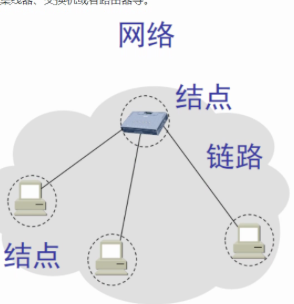
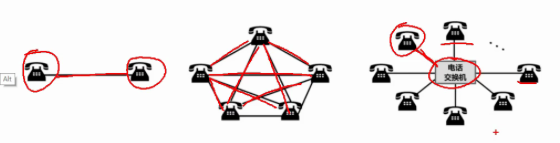
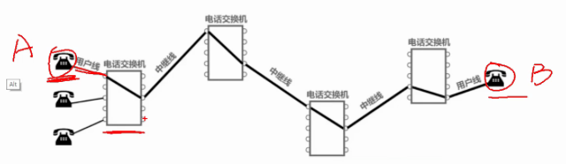
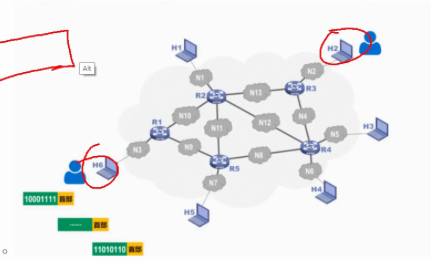
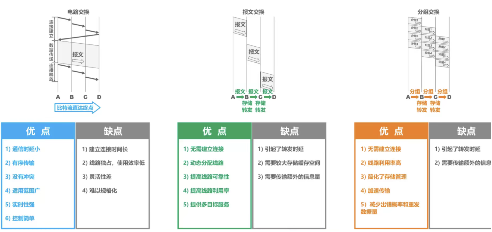
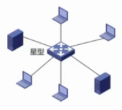
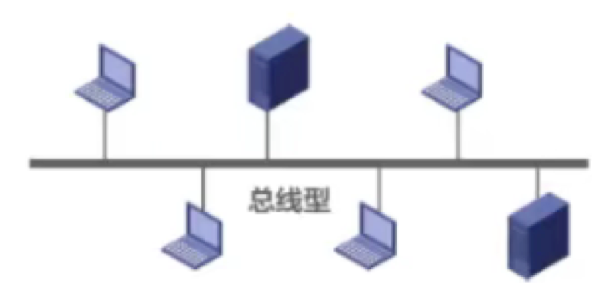

- 网络是什么？
	- 由若干节点和连接这些节点的链路组成。可以是计算机，集线器，交换机或者路由器等。现在的话，集线器很少了，大型的网络节点里可能会用到交换机。路由器的话，家庭里用到。
	- 
	- 多个网络通过路由器互联，构成覆盖范围更大的计算机网络。为互联网
- 组成
	- 边缘部分 连接在互联网上的主机
	- 核心部分 网络及网络的路由器组成，为边缘部分提供服务
	- 边缘部分
		- 主机A的进程 和主机B的进程来通信的
		- 通信分类
			- 客户服务器方式 cs方式 客户端要知道服务端的IP地址 服务端要有很强的服务支撑能力
			- p2p 对等方式 不区分谁是服务请求方及提供方 运行了对等的连接软件就可以平等的进行通信，迅雷，qq
				- 非中心化
				- 健壮性
				- 高性价比
				- 隐私保护
	- 核心部分
		- 路由器
		- 三种交换方式
			- 电路交换 电话交换机接通电话线的方式
				- 
				- 步骤
					- 建立连接
					- 通话
					- 释放连接
				- 
				- 缺点
					- 用户输入编辑一份传输文件时，线路被占用了，浪费了资源，效率很低
			- 分组交换
				- 路由器 存储转发收到的分组。
				- 存储转发技术，把报文分成多个分组后进行传送，把报文拆分之后，加上控制信息首部，构成了分组，分组又叫包，分组的头部叫包头，包头里有目的地址和原地址等信息，才能到终点
				- 
				- 将报文中的一个个分组进行存储转发，可以进行差错校验，保证报文的完整性和准确性
			- 报文交换
				- 整个报文发到相邻节点，全部存储下来查找转发表，转发到下一个结点，对报文大小不限制
			- 对比
				- 
- 计算机网络分类
	- 网络作用范围
		- 广域网 核心部分，长距离，跨越国家，高速链路
		- 城域网 城市 5-50km
		- 局域网  工作栈 学校 工厂 企业
		- 个人区域网 个人的无线连接 10m
	- 线路结构
		- 星型
			- 
			- 局域网普遍使用的，用一个节点作为中心节点，其他节点直接和中心节点进行连接。中心节点可以是文件服务器也可以是连接设备。常见的是集线器或者路由器
			- 集中控制型网络，节点之间的通信都要到中心节点。传输的数据也是先要发送到中心节点，再发送到目的节点
			- 中心节点复杂，负担大。
			- 优点
				- 控制简单，访问协议也简单。便于监控管理
				- 故障诊断和隔离容易，单个节点故障只会影响一个设备
				- 方便服务
			- 缺点
				- 需要耗费大量电缆，安装维护工作量大
				- 中央节点挂了就完了
				- 没有用好各个站点，分布处理能力低
		- 总线型
			- 
			-