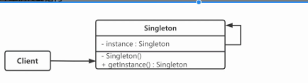
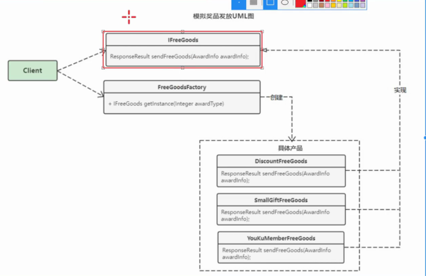
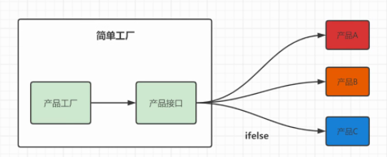
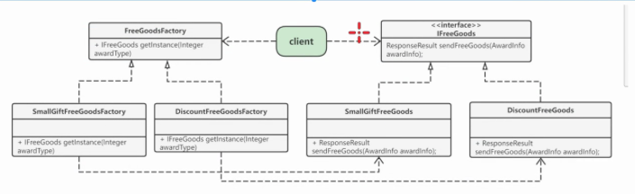
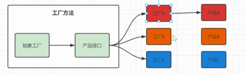
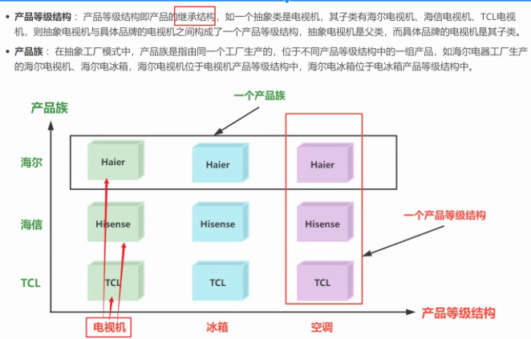
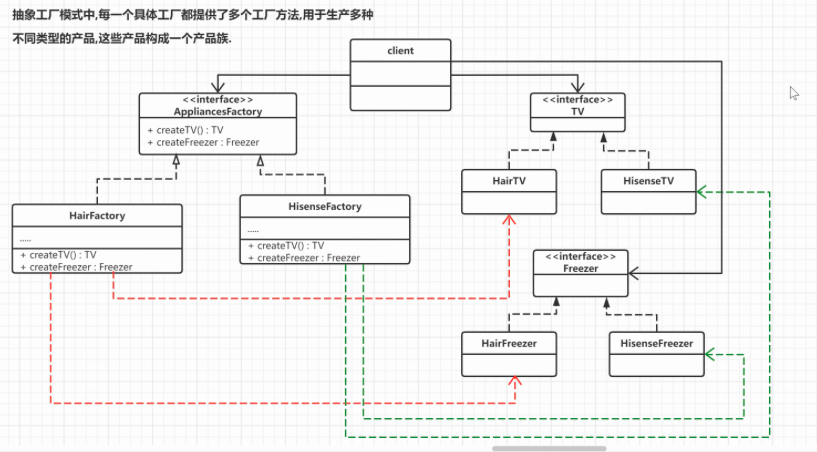
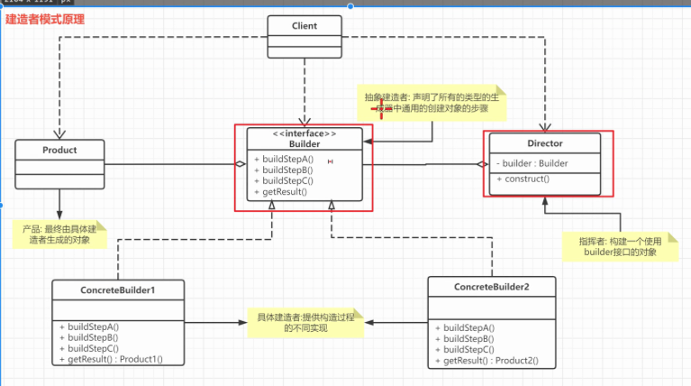
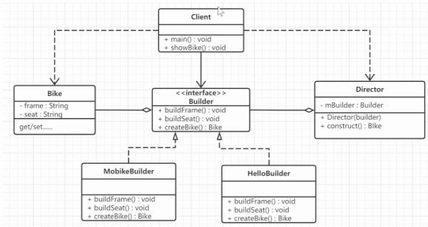
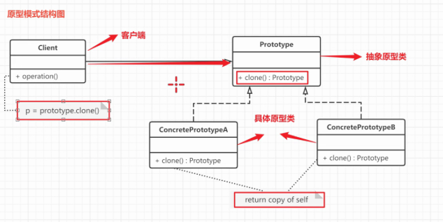

- 创建模式 - 提供创建对象的机制，能够提升已有代码的灵活性和复用性
- 单例设计模式
	- 定义
		- 保证某个类在运行期间，只有一个实例对外提供服务
		- 为该实例提供一个全局访问点 getInstance
	- 结构
		- 
	- 实现
		- 饿汉式
			- ```
			  /**
			   * 饿汉式
			   * 在类加载期间初始化私有的静态实例，保证instance实例创建过程是线程安全的
			   特点：不支持延时加载，获取实例对象的速度比较快，能直接用，但是如果对象比较大
			   而且一直没有使用，造成内存的浪费
			   */
			  public class Singleton01 {
			      // 1. 私有构造方法
			      private Singleton01() {
			      }
			      
			      // 2.在本类中创建私有静态全局对象
			      
			      private static Singleton01 instance = new Singleton01();
			      
			      // 3.提供静态方法获取实例
			      public static Singleton01 getInstance() {
			          return instance;
			      }
			  }
			  
			  ```
		- 懒汉式 - 支持延时加载
			- ```
			  public class Singleton_02 {
			      //1. 私有构造方法
			      private Singleton_02(){}
			  
			      //2. 在本类中创建私有静态的全局对象
			      private static Singleton_02 instance;
			  
			      //3. 通过判断对象是否被初始化,来选择是否创建对象
			      public static  Singleton_02 getInstance(){
			          if(instance == null){
			              instance = new Singleton_02();
			          }
			          return instance;
			      }
			  }
			  ```
			- 不是线程安全的，因为可能同时有俩线程都获取到instance为空，就会导致创建了俩
		- 懒汉式 - 线程安全
			- 加Synchronized 每次只能有一个获取锁，去执行new操作
				- ```
				  
				  public class Singleton_03 {
				      //1. 私有构造方法
				      private Singleton_03(){}
				  
				      //2. 在本类中创建私有静态的全局对象
				      private static Singleton_03 instance;
				  
				      //3. 通过添加synchronize,保证多线程模式下的单例对象的唯一性
				      public static synchronized  Singleton_03 getInstance(){
				          if(instance == null){
				              instance = new Singleton_03();
				          }
				          return instance;
				      }
				  }
				  ```
				- 虽然线程安全了，但是锁的粒度太大了，其实初始化的时候可能出现问题只是在初始化的时候，初始化完成了之后就不会有问题了
				- 解决方式：双重校验锁
		- 双重校验锁
			- 在instance==null的时候才去加锁，加锁之后如果不在校验下的话，会导致他执行完了，下个线程又获取到锁了，还是会去创建多个
			- 所以获取锁之后要再校验一次
			- 这时候要加个volatile，因为初始化对象有三步，1. 分配内存控制 2. 初始化对象 3. 将instance对象指向分配好的内存空间。
				- 如果不加这个，可能会产生指令重排序，虽然isntance已经不为空了，但是还没有实例化，导致报错
			- ```
			  public class Singleton_04 {
			      //使用 volatile保证变量的可见性
			      private volatile static Singleton_04 instance = null;
			      private Singleton_04(){
			      }
			      //对外提供静态方法获取对象
			      public static Singleton_04 getInstance(){
			          //第一次判断,如果instance不为null,不进入抢锁阶段,直接返回实例
			          if(instance == null){
			              synchronized (Singleton_04.class){
			                  //抢到锁之后再次进行判断是否为null
			                  if(instance == null){
			                      instance = new Singleton_04();
			                  }
			              }
			          }
			          return instance;
			      }
			  }
			  ```
		- 静态内部类
			- ```
			  public class Singleton_05 {
			  
			      private static class SingletonHandler{
			          private static Singleton_05 instance = new Singleton_05();
			      }
			  
			      private Singleton_05(){}
			  
			      public static Singleton_05 getInstance(){
			          return SingletonHandler.instance;
			      }
			  }
			  ```
			- 静态内部类特性，只有在使用到的时候才会被创建及加载
			- 同时解决延时加载，线程安全问题，而且代码更加简洁
		- 枚举方式
			- 可以解决反射，序列化对单例的破坏
			- ```
			  public enum Singleton_06{
			  
			      INSTANCE;
			  
			      private Object data;
			  
			      public Object getData() {
			          return data;
			      }
			  
			      public void setData(Object data) {
			          this.data = data;
			      }
			  
			      public static Singleton_06 getInstance(){
			  
			          return INSTANCE;
			      }
			  }
			  ```
			- 组织反射破坏
				- 枚举没有孔灿构造方法，反射方法中不允许使用反射创建枚举对象
			- 组织序列化破坏
				- Java规范字规定，每个枚举类型及其定义的枚举变量在JVM中都是唯一的，因此在枚举类型的序列化和反序列化上，Java做了特殊的规定。
				- 在序列化的时候Java仅仅是将枚举对象的name属性输到结果中，反序列化的时候则是通过java.lang.Enum的valueOf()方法来根据名字查找枚举对象。
				- 比如说，序列化的时候只将`INSTANCE`这个名称输出，反序列化的时候再通过这个名称，查找对应的枚举类型，因此反序列化后的实例也会和之前被序列化的对象实例相同。
	- 反射对于单例的破坏
		- ```
		  public class Test_Reflect {
		  
		      public static void main(String[] args) {
		  
		          try {
		              
		              //反射中，欲获取一个类或者调用某个类的方法，首先要获取到该类的Class 对象。
		              Class<Singleton_05> clazz = Singleton_05.class;
		  
		              //getDeclaredXxx: 不受权限控制的获取类的成员.
		              Constructor c = clazz.getDeclaredConstructor(null);
		  
		              //设置为true,就可以对类中的私有成员进行操作了!!!
		              c.setAccessible(true);
		  
		              Object instance1 = c.newInstance();
		              Object instance2 = c.newInstance();
		  
		              System.out.println(instance1 == instance2);
		          } catch (Exception e) {
		              e.printStackTrace();
		          }
		      }
		  }
		  ```
		- 解决方法
			- 在构造函数里，判断下，当调用私有构造方法时，如果instance不为空的话，直接抛出异常
			- ```
			      private Singleton_05(){
			          if(SingletonHandler.instance != null){
			              throw new RuntimeException("不允许非法访问!");
			          }
			      }
			  ```
			- 不够优雅，代码间接性遭到破坏
	- 序列化对单例的破坏
		- 序列化对象输出流，放到一个文件里。序列化对象输入流，从文件里读取出来
		- 比较之后，发现序列化前后，对象不是同一个对象了。
		- 解决方法
			- ```
			  /**
			  * 解决方案:只要在Singleton类中定义readResolve就可以解决该问题
			  * 程序会判断是否有readResolve方法,如果存在就在执行该方法,如果不存在--就创建一个对象
			  */
			  private Object readResolve() {
			  	return singleton;
			  }
			  ```
-
- 工厂方法模式
	- 创建对象时不会对客户端暴露创建逻辑，通过使用一个共同的接口来指向新创建的对象
	- 需求
		- 互联网电商中促销拉新，新用户注册立即参与抽奖活动，奖品有打折券，免费会员，小礼品
		- 原始开发方式
			- 要添加新的奖品时，要改动DeliverController代码，违反开闭原则，如果有的抽奖接口出现问题，重构成本比较高
			- 一直用if else 其实维护成本也很高
		- 简单工厂
			- 比较像一种编程习惯。静态工厂方法模式，用静态方法接受不同参数返回不同实例对象，多态
			- 定义工厂类，根据传入参数不同返回不同实例，被创建的实例有共同的父类或接口
			- 适用场景
				- 创建对象较少 简单工厂只有一个工厂类
				- 客户端不关心对象的创建过程
			- 结构
				- 抽象产品 抽象类的共性，接口或者是抽象类
				- 具体产品 实现或继承抽象产品子类
				- 具体工厂 提供创建产品方法，调用这个方法获取产品
			- UML图
				- 
			- 总结
				- 优点
					- 封装了创建对象的过程，可以通过参数直接获取对象。把对象的创建和业务逻辑层分开，这样以后就避免了修改客户代码，如果要实现新产品直接修改工厂类，而不需要在原代码中修改，这样就降低了客户代码修改的可能性，更加容易扩展。
				- 缺点
					- 增加新产品时还是需要修改工厂类的代码，违背了“开闭原则”。
				- 
		- 工厂方法
			- 介绍
				- 定义一个创建对象的接口，让子类决定实例化哪个产品对象。
				- 让对一个产品类的实例化延迟到其工厂的子类
			- 目的
				- 把对象创建的过程也进行封装，提升创建对象方法的可复用性
			- 角色
				- 抽象工厂 提供创建产品的接口
				- 具体工厂 完成具体产品的创建
				- 抽象产品 定义产品规范，描述产品特性和功能
				- 具体产品 实现抽象产品定义的接口
			- 
			- 总结
				- 会有个抽象的工厂，每个产品都会有个具体的工厂类，专门生产这种类型的产品
				- 优点
					- 用户只需要知道具体工厂的名字，就可以获取到指定的产品，无需关注产品的创建流程
					- 新增加产品的时候，只需要具体产品类和具体产品工厂，不需要对原来的工厂修改
				- 缺点
					- 每增加一个产品，就要产品类+产品工厂类，感觉有点太复杂了
				- 
- 抽象工厂模式
	- 抽象工厂模式比工厂模式抽象程度更高，工厂方法里，一个具体工厂只生产一种具体的产品
	- 抽象工厂中，一个具体工厂生产一组产品，这样一组产品叫做产品族。产品族中的每个产品都属于某一个产品继承等级结构。
	- 概念
		- 产品族
		- 产品等级结构
		- 
	- 概述
		- 提供一个创建一系列相关或相互依赖对象的接口，而无需指定他们具体的类
		- 创建一组对象，负责创建一个产品族
	- UML类图
		- 
	- 总结
		- 程序所支持的实例集合（具体工厂）的数目；
		- 当前是使用的实例集合中的哪一个实例；
		- 在任意给定时刻被实例化的具体类型；
		- 优点
			- 对于不同产品系列有比较多共性特征时，可以使用抽象工厂模式，有助于提升组件的复用性.
			- 当需要提升代码的扩展性并降低维护成本时，把对象的创建和使用过程分开，能有效地将代码统一到一个级别上
			- 解决跨平台带来的兼容性问题
		- 缺点
			- 增加新的产品等级结构麻烦,需要对原有结构进行较大的修改,甚至需要修改抽象层代码,这显然会带来较大不变,违背了开闭原则.
- 建造者模式
	- 定义
		- 生成器模式，将一个复杂对象的构建和表示分离，将同样的构建过程可以创建不同的表示
	- 解决问题
		- 复杂对象的创建，分步骤构建对象
		- > 比如: 一辆汽车是由多个部件组成的,包括了车轮、方向盘、发动机等等.对于大多数用户而言,并不需要知道这些部件的装配细节,并且几乎不会使用单独某个部件,而是使用一辆完整的汽车.而建造者模式就是负责将这些部件进行组装让后将完整的汽车返回给用户
	- 角色
		- 抽象建造者 规定要实现复杂对象的哪些部分的创建，不涉及具体idea部件对象的创建
		- 具体建造者类 实现builder接口，完成复杂产品各个部件的具体创建方法，构造过程结束后，提供一个方法，返回创建好的负责产品对象
		- 产品类 要创建的复杂对象 包含多个组成部件
		- 指挥者类 调用具体的建造者创建复杂对象的各个部分，不涉及具体产品的信息，只负责保证对象各部分完整创建或按照某个顺序创建
		- client 客户端，声明要具体创建哪个产品
		- 
	- 实例
		- 创建共享单车
		- 
	- 实例
		- 类构造器里需要传入很多参数的时候，创建这个类的实例，代码可读性很差，很容易引入错误
		- 目标类的构造方法传入一个Builder对象
		- builder类位于目标类内部，用static修饰
		- builder类对象提供内置各种set方法，set方法返回值是builder本身
		- builder类提供一个build方法，实现目标对象的创建
	- 总结
		- 工厂模式是创建不同但是相关类型的对象，给定的参数决定创建哪种类型的对象
		- 建造者是创建一种类型的复杂对象，通过设置不同的可选参数，定制化创建不同的对象
		- 优点
			- 建造者模式的封装性很好。使用建造者模式可以有效的封装变化，在使用建造者模式的场景中，一般产品类和建造者类是比较稳定的，因此，将主要的业务逻辑封装在指挥者类中对整体而言可以取得比较好的稳定性
				- 在建造者模式中，客户端不必知道产品内部组成的细节，将产品本身与产品的创建过程解耦，使得相同的创建过程可以创建不同的产品对象。
				- 可以更加精细地控制产品的创建过程 。将复杂产品的创建步骤分解在不同的方法中，使得创建过程更加清晰，也更方便使用程序来控制创建过程。
				- 建造者模式很容易进行扩展。如果有新的需求，通过实现一个新的建造者类就可以完成，基本上不用修改之前已经测试通过的代码，因此也就不会对原有功能引入风险。符合开闭原则。
		- 缺点
			- 建造者模式所创建的产品一般具有较多的共同点，其组成部分相似，如果产品之间的差异性很大，则不适合使用建造者模式，因此其使用范围受到一定的限制。
		- 应用场景
			- 建造者（Builder）模式创建的是复杂对象，其产品的各个部分经常面临着剧烈的变化，但将它们组合在一起的算法却相对稳定，所以它通常在以下场合使用。
				- 创建的对象较复杂，由多个部件构成，各部件面临着复杂的变化，但构件间的建造顺序是稳定的。
				- 创建复杂对象的算法独立于该对象的组成部分以及它们的装配方式，即产品的构建过程和最终的表示是独立的。
- 原型模式
	- 用一个已经创建的实例作为原型，通过复制该原型对象来创建一个和原型对象相同的新对象。 对象的拷贝
	- 解决问题
		- 如果创建对象的成本比较大,比如对象中的数据是经过复杂计算才能得到,或者需要从RPC接口或者数据库等比较慢的IO中获取,这种情况我们就可以使用原型模式,从其他已有的对象中进行拷贝,而不是每次都创建新对象,进行一些耗时的操作.、
		- 和复制的对象差异比较小
	- 原理
		- 
		- 抽象原型类 不需要我们自己去定义
	- 克隆
		- 浅拷贝 被复制对象的所有变量都含有与原来的对象相同的值，而所有的对其他对象的引用仍然指向原来的对象(克隆对象与原型对象共享引用数据类型变量)。
		- 深拷贝 除去那些引用其他对象的变量，被复制对象的所有变量都含有与原来的对象相同的值。那些引用其他对象的变量将指向被复制过的新对象，而不再是原有的那些被引用的对象。换言之，深复制把要复制的对象所引用的对象都复制了一遍。
		- Java中的Object类中提供了 `clone()` 方法来实现**浅克隆**。需要注意的是要想实现克隆的Java类必须实现一个标识接口 Cloneable ,来表示这个Java类支持被复制.
		- Cloneable接口是上面的类图中的抽象原型类，而实现了Cloneable接口的子实现类就是具体的原型类。
	- 其实现在不推荐大家用Cloneable接口，实现比较麻烦，现在借助Apache Commons或者springframework可以直接实现：
	- 浅克隆：`BeanUtils.cloneBean(Object obj);BeanUtils.copyProperties(S,T);`
	- 深克隆：`SerializationUtils.clone(T object);` 
	  BeanUtils是利用反射原理获得所有类可见的属性和方法，然后复制到target类。SerializationUtils.clone()就是使用我们的前面讲的序列化实现深克隆，当然你要把要克隆的类实现Serialization接口。
	- 优缺点
		- 当创建新的对象实例较为复杂时,使用原型模式可以简化对象的创建过程, 通过复制一个已有实例可以提高新实例的创建效率.
		  
		     > 比如，在 AI 系统中，我们经常需要频繁使用大量不同分类的数据模型文件，在对这一类文件建立对象模型时，不仅会长时间占用 IO 读写资源，还会消耗大量 CPU 运算资源，如果频繁创建模型对象，就会很容易造成服务器 CPU 被打满而导致系统宕机。通过原型模式我们可以很容易地解决这个问题，当我们完成对象的第一次初始化后，新创建的对象便使用对象拷贝（在内存中进行二进制流的拷贝），虽然拷贝也会消耗一定资源，但是相比初始化的外部读写和运算来说，内存拷贝消耗会小很多，而且速度快很多
		  
		  2. 原型模式提供了简化的创建结构,工厂方法模式常常需要有一个与产品类等级结构相同的工厂等级结构(具体工厂对应具体产品),而原型模式就不需要这样,原型模式的产品复制是通过封装在原型类中的克隆方法实现的,无须专门的工厂类来创建产品.
		  
		  3. 可以使用深克隆的方式保存对象状态,使用原型模式将对象复制一份并将其状态保存起来,以便在需要的时候使用,比如恢复到某一历史状态,可以辅助实现撤销操作.
		  
		     > 在某些需要保存历史状态的场景中，比如，聊天消息、上线发布流程、需要撤销操作的程序等，原型模式能快速地复制现有对象的状态并留存副本，方便快速地回滚到上一次保存或最初的状态，避免因网络延迟、误操作等原因而造成数据的不可恢复。         
		  
		  **原型模式缺点**
		- 需要为每一个类配备一个克隆方法,而且该克隆方法位于一个类的内部,当对已有的类进行改造时需要修改源代码,违背了开闭原则.
	- **使用场景**
		- 资源优化场景。也就是当进行对象初始化需要使用很多外部资源时，比如，IO 资源、数据文件、CPU、网络和内存等。
		- 复杂的依赖场景。 比如，F 对象的创建依赖 A，A 又依赖 B，B 又依赖 C……于是创建过程是一连串对象的 get 和 set。
		- 性能和安全要求的场景。 比如，同一个用户在一个会话周期里，可能会反复登录平台或使用某些受限的功能，每一次访问请求都会访问授权服务器进行授权，但如果每次都通过 new 产生一个对象会非常烦琐，这时则可以使用原型模式。
		- 同一个对象可能被多个修改者使用的场景。 比如，一个商品对象需要提供给物流、会员、订单等多个服务访问，而且各个调用者可能都需要修改其值时，就可以考虑使用原型模式。
		- 需要保存原始对象状态的场景。 比如，记录历史操作的场景中，就可以通过原型模式快速保存记录。