- 类图概述
	- 统一建模语言 用来设计软件的可视化建模语言
	- 特点：简单，统一，图形化，能表达软件设计中的动态与静态信息
- 分类
	- 静态结构图
		- 类图
		- 对象图
		- 组件图
		- 部署图
	- 动态行为图
		- 状态图
		- 活动图
		- 时序图
		- 协作图
		- 构件图
- 类图
	- 反应类结构和类之间关系
- 类结构表示法-在UML类图中表示具体类
	- 用长方形描述类的构成
	- 分成三层
		- 名称
		- 属性
		- 方法
		- 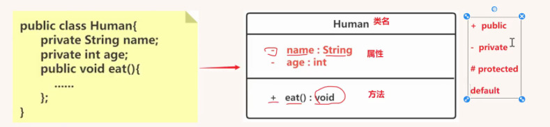
	- 抽象类
		- 名称是斜体的，方法名也是斜体的
		- 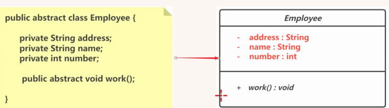
	- 接口
		- 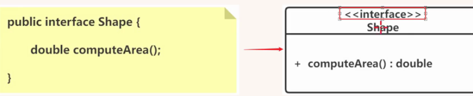
		- 接口的第一层顶端用<<interface>>来表示
- 类和类之间的关系
	- 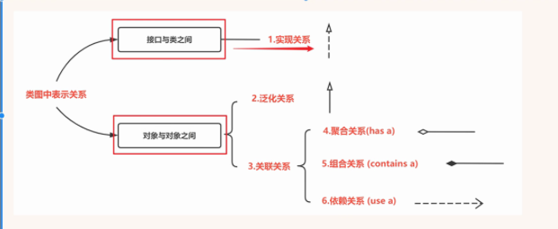
	- 实现关系
		- 类实现了某个接口
		- vehicle交通工具接口 car和ship实现了这个接口
		- 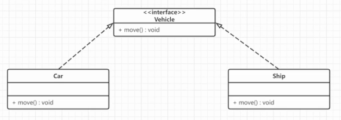
	- 泛化关系
		- 继承关系
		- 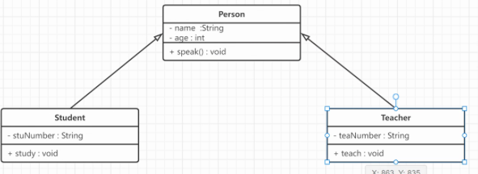
	- 关联关系
		- 单向关联
			- Customer 有个住址 成员变量
			- 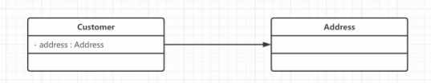
		- 双向关联
			- 顾客购买了多个商品，商品被多个顾客购买
			- 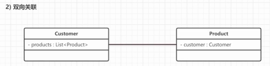
		- 自关联
			- 节点下有子节点，都是Node类型
			- 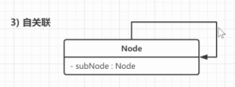
	- 聚合关系 - 关联关系的一种，表示一种弱的拥有关系 has a
		- 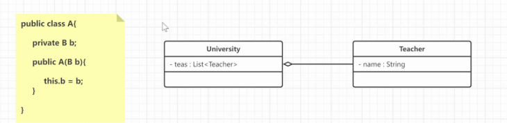
		- 虽然A类里面有B，但是B的生命周期并不由A来决定
		- 大学里有老师，但是老师也可以离开大学，也可以有自己的行为
	- 组合关系 - 强拥有关系 contains a
		- B类对象的生命周期依赖A类的生命周期
		- 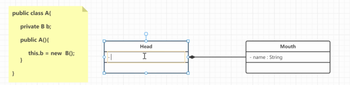
	- 依赖关系-对象之间耦合度最弱的一种关联的方式  use a
		- 通过局部变量或者对静态方法的调用去访问另外一个类
		- 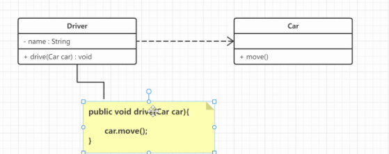
		-