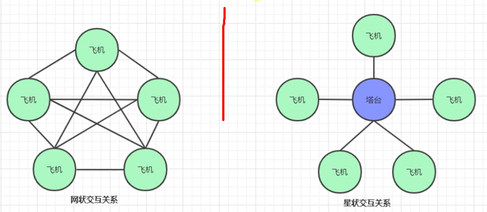
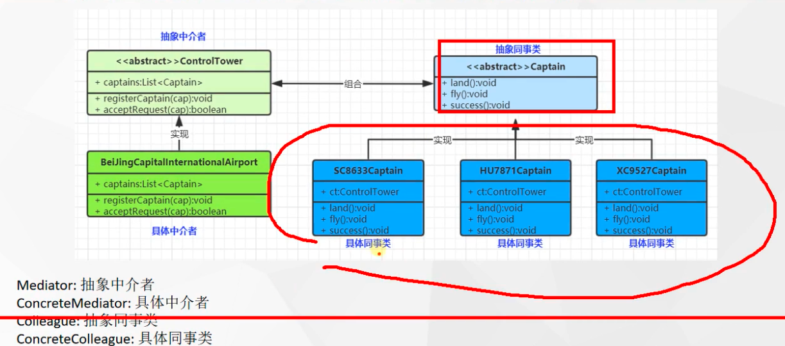

tags:: 设计模式，中介者模式

- 
- 中介者模式，用一个中介对象来封装一系列的对象交互，让各个对象不需要显式的相互引用，减少对象之间的依赖关系
- 
- 有个中间的控制类，所有的同事类的请求都发给这个中介者，中介者管理接收到的所有请求，进行统一的管理和协同
- 要注意所有的同事类应用的都要是同一个中介者，不然状态不会被同步
- 将一个网状的关系变成一个星状的关系
- 应用场景
	- SpringMVC 的 DispatcherServlet是一个中介者，他会提取Controller、Model、View来进行调用。而无需controller直接调用view之类的渲染方法
	- 分布式系统中的网关
	- 迪米特法则的一个典型应用