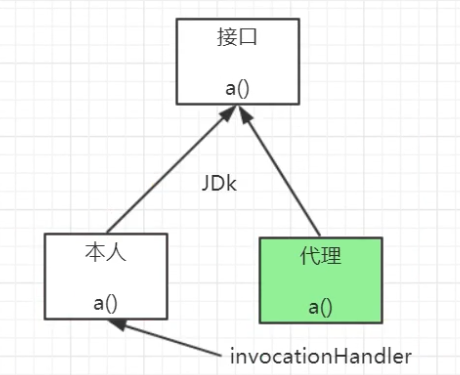
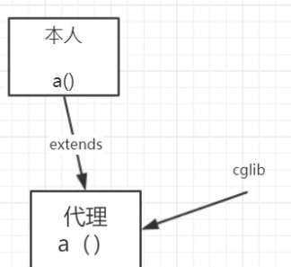

tags:: 设计模式，代理模式

- 给某个对象提供一个代理，并由代理对象控制对原来对象的引用，对象结构型模式。静态代理
- 
- 主要是控制
- 静态代理
	- 一般说装饰器模式是静态代理的一种
	- *代理的东西不一样，每一种不同的被代理类**Person**、**Dog**、**Cat,**创建不同的静态代理类*
	- 静态代理中想要对某个类进行代理的时候，都要去实现对应的代理类，代理类和被代理类实现同一个接口，然后在代理类里面定义被代理对象，在方法里调用被代理对象的方法，从而实现这个代理，很不智能。
	- ```
	  /**
	   * 代理一般都是和被代理对象属于同一个接口
	   */
	  public class LiMingTiktokProxy implements ManTikTok{
	  
	      private ManTikTok manTikTok; //被代理对象
	      public LiMingTiktokProxy(ManTikTok manTikTok){
	          this.manTikTok = manTikTok;
	      }
	  
	  
	      /**
	       * 宋喆（代理）  宝强（被代理对象）
	       */
	      @Override
	      public void tiktok() {
	          //增强功能
	          System.out.println("渲染直播间....");
	          System.out.println("课程只要666，仅此一天....");
	          manTikTok.tiktok();
	  
	      }
	  }
	  ```
- 动态代理
	- jdk的动态代理要求被代理对象的类必须实现了接口，否则创建不出来代理对象
	- 
	- 动态代理的好处就是，传入的是泛型，所有的不同的类都可以使用这个动态代理类来进行代理。他也是使用代理类和被代理类用实现同一个接口来实现的。
	- 用Proxy.newProxyInstance方法，入参是1. 当前被代理对象的类加载器，2. 当前被代理对象实现的所有接口（因为代理类也要实现对应的接口）， 3. 定义的拦截增强方法。
	- 所以这个代理类要实现InvocationHandler接口，他的invoke方法能使得被代理类所有的方法执行的时候，都会去调用这个invoke方法。在这里用反射区调用真正的被代理类的方法
	- ```
	  public class JdkTiktokProxy<T> implements InvocationHandler {
	  
	      private T target;
	  
	      // 接收被代理对象
	      public JdkTiktokProxy(T target) {
	          this.target = target;
	      }
	  
	      /**
	       * 获取被代理对象的代理对象
	       * @param t
	       * @return
	       * @param <T>
	       */
	      public static<T> T getProxy(T t) {
	  
	          /**
	           * ClassLoader loader, 当前被代理对象的类加载器
	           * Class<?>[] interfaces, 当前被代理对象所实现的所有接口
	           * InvocationHandler h， 当前被代理对象执行目标方法的时候，我们使用h可以定义拦截增强方法
	           */
	          Object object = Proxy.newProxyInstance(t.getClass().getClassLoader(),
	                  t.getClass().getInterfaces(),
	                  new JdkTiktokProxy(t));
	  
	          return (T)object;
	      }
	  
	      /**
	       * 定义目标方法的拦截逻辑
	       * 每个方法都会进来，只要调用了代理对象的任何方法都会被执行
	       * @param proxy the proxy instance that the method was invoked on
	       *
	       * @param method the {@code Method} instance corresponding to
	       * the interface method invoked on the proxy instance.  The declaring
	       * class of the {@code Method} object will be the interface that
	       * the method was declared in, which may be a superinterface of the
	       * proxy interface that the proxy class inherits the method through.
	       *
	       * @param args an array of objects containing the values of the
	       * arguments passed in the method invocation on the proxy instance,
	       * or {@code null} if interface method takes no arguments.
	       * Arguments of primitive types are wrapped in instances of the
	       * appropriate primitive wrapper class, such as
	       * {@code java.lang.Integer} or {@code java.lang.Boolean}.
	       *
	       * @return
	       * @throws Throwable
	       */
	      @Override
	      public Object invoke(Object proxy, Method method, Object[] args) throws Throwable {
	          // 反射执行
	          System.out.println("真正执行被代理对象的方法");
	          Object invoke = method.invoke(target, args);
	          System.out.println("返回值：" + invoke);
	          return invoke;
	      }
	  }
	  ```
	- 在调用的时候，如果当前这个被代理类实现了两个接口，那就按照实际定义的时候，返回的是哪个接口的定义，以及调用哪个接口的方法来决定这个代理类实现什么接口
	- 代理类不能去代理这个被代理类自己的方法（因为没有相同的接口可以实现）
- cglib
	- 
	- JDK动态代理的话，要求必须有接口，cglib的话，就没有这个限制。因为他是通过继承来进行实现的
	- 会先创建一个增强器，设置要增强哪个类的功能之后，会为要增强的这个类创建一个子类，这样他就会天然的拥有被代理类的所有方法。
	- 设置回调，在回调方法里会用反射调用父类方法。
	- 最后创造出增强器
	- ```
	  public class CglibProxy {
	  
	      //为任意对象创建代理
	      public static<T> T createProxy(T t){
	          //1、创建一个增强器
	          Enhancer enhancer = new Enhancer();
	  
	          //2、设置要增强哪个个类的功能。增强器为这个类动态创建一个子类
	          enhancer.setSuperclass(t.getClass());
	  
	          //3、设置回调
	          enhancer.setCallback(new MethodInterceptor() {
	              @Override
	              public Object intercept(Object obj,
	                                      Method method,  //为了能获取到原方法的一些元数据信息
	                                      Object[] args,
	                                      MethodProxy proxy) throws Throwable {
	                  //编写拦截的逻辑
	                  System.out.println("cglib上场le .......xxx");
	                  //当前方法的信息
	  //                method.get
	  //                method.getAnnotation()
	                  //目标方法进行执行
	                  Object invoke = proxy.invokeSuper(obj,args);
	                  return invoke;
	              }
	          });
	  
	          Object o = enhancer.create();
	          return (T) o;
	      }
	  }
	  ```
- 什么场景用到？
	- MyBatis的mapper到底是什么？怎么生成的？
	- Seata的DataSourceProxy是什么？
	- DruidDataSource存在的Proxy模式
-