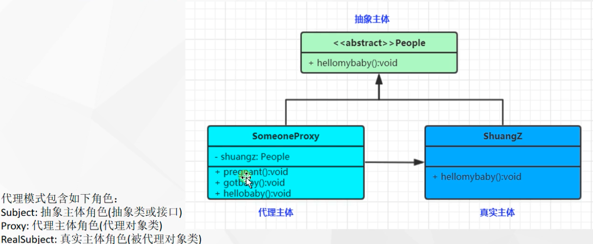

tags:: 设计模式，代理模式

- 给某个对象提供一个代理，并由代理对象控制对原来对象的引用，对象结构型模式。静态代理
- 
- 主要是控制
- 静态代理
	- 一般说装饰器模式是静态代理的一种
	- *代理的东西不一样，每一种不同的被代理类**Person**、**Dog**、**Cat,**创建不同的静态代理类*
	-
- 动态代理
	- jdk的动态代理要求被代理对象的类必须实现了接口，否则创建不出来代理对象