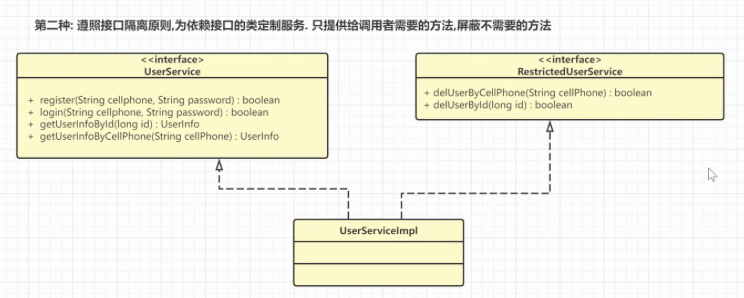

- 设计的要求
- SOLID 稳定的
- 单一职责原则 single responsibility principle
	- 一个类或者模块只负责完成一个职责
	- 设计粒度小，功能单一的类
	- 
	- 要根据实际业务场景拆分，如果其中一部分属性需要被各个场景都需要使用，那就要将这个属性拆分出来以供不同的模块进行使用
	- 如何判断一个类的职责是否单一
		- 类当中的代码行数 函数 属性过多
		- 类依赖的其他的类过多
		- 私有的方法过多
		- 类中的大量方法总是操作类中的几个属性，其他属性基本上都不咋用
- 开放封闭原则 open close principle
	- 在面向对象中，软件中的对象，类，模块和函数**对扩展开放，对修改封闭**
	- 用抽象定义结构，用具体实现扩展细节，确保软件系统开发和维护过程的可靠性
	- 优点
		- 新老逻辑解耦，需求发生改变不会影响老业务逻辑
		- 改动成本小，只需追加新逻辑无需改老逻辑
		- 提高代码稳定性，可扩展性
	- 
	- 是所有设计模式最核心的目标，顶层设计思维
		- 抽象意识
		- 封装意识
		- 扩展意识
- 里氏替换原则 liskov substitution principle
	- 如果s是t的子类型，对于s类型的任意对象，如果将他们看做是t类型的对象，则对象行为也应该与期望的行为一致
	- 什么是替换
		- 多态，同一个行为有不同表现形式或形态的能力
		- 一个方法参数是接口类型时，可以接收所有实现过这个接口的实现类
	- 什么是与期望行为一致的替换
		- 在不了解派生类的情况下，通过接口或者基类的方法，能知道方法的行为，不管哪种派生类的实现，都和接口或基类方法的期望行为一致
	- 
	- 定义个cal，在setstrategy的时候传入的是具体的实现类，然后在cal方法中，其实是去调用具体的实现类的具体实现来进行的
	- 子类的实现应该和抽象类和接口的定义保持一致，以便上层能够不管具体是怎么实现的，只要定义步骤就可以
- 接口分离原则 interface segregation principle
	- 一个类对另外一个类的依赖应该建立在最小的接口
	- 为各个类建立他们需要的专用接口，不要试图建立一个很庞大的接口来供所有依赖它的类调用
	- 
	- 
	- 比如说给molo的接口，为了不让他们调用我们的各个方法，把设计他们的放到一个类里去
	- 在实现上也是，不要都定义在一个接口里，让实现类都实现，delay那个接口和限流的接口，职责功能不一样，有的要用有的不要用的时候，就可以抽出来变成两个接口，供下游使用者自己去选，自己需要实现哪些功能
	- 优势
		- 将胖接口分解成多个粒度小的接口，可以提高系统的灵活性和可维护性
		- 使用多个专门的接口，还能够体现出对象的层次
		- 能够减少项目工程中的冗余代码，接口定义一堆，只要用几个，就会被迫写很多冗余的代码
- 依赖倒置原则 dependence inversion principle
	- 高层模块不应该依赖于底层模板，二者都应该依赖于抽象，抽象不应该依赖于细节，细节应该依赖于抽象
	- 在软件设计中，细节有多变性，抽象层稳定，以抽象为基础搭建起来的架构比以细节为基础搭建起来的架构更加稳定
	- 
	- 
	- 依赖倒置
		- 软件设计原则 主要用来指导框架层面的设计
	- 控制反转
		- 指导思想，一种框架设计常用的模式，但是不是具体方法，之前是由程序员来控制，后来引入了框架之后，交给框架来进行控制 IOC
	- 依赖注入
		- 是实现控制反转的手段，是一种具体的编码技巧
- 迪米特法则 least knowledge principle
	- 一个类或模块对其他的类或模块的了解越少越好
	- 不该有直接依赖关系的，不要有依赖。有依赖关系的类之间，尽量只依赖必要的接口
	- 多使用中间人，通过第三方来进行沟通
	- 
	- 
	- 使用不好，可能有大量的中间者