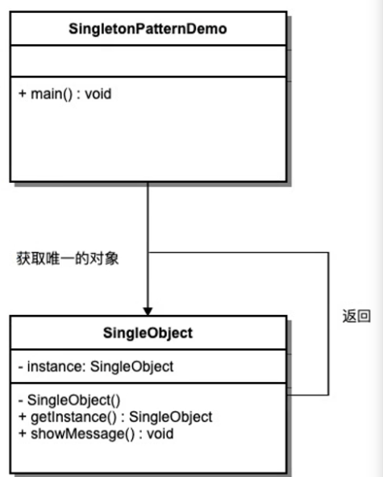

tags:: 设计模式 单例

- 定义：一个单一的类，负责创建自己的对象，同时确保系统只有单个对象被创建
- 单例特点
	- 这个类只能有一个实例（构造器是私有的
	- 自己自行创建这个实例（自己编写实例化逻辑
	- 自行向整个系统提供这个实例（提供实例化方法
- 
- 恶汉模式
	- 很饥饿，一上来就创建了，在第一次加载这个类的时候就能创建出来
	- ```
	  public class Person {
	      private String name;
	      private String age;
	  
	      private final static Person instance = new Person();
	  
	      // 构造器私有，外部不能实例化
	      private Person() {}
	  
	      public static Person guiguBoss() {
	          return instance;
	      }
	  }
	  ```
	- 缺点，可能一次都用不到，而且创建一次的消耗很大，所以并不推荐
- 懒汉模式
	- 一开始不创建，等到别人来调用的时候再创建
	- ```
	  public class Person {
	      private String name;
	      private String age;
	  
	      private static Person instance;
	  
	      // 构造器私有，外部不能实例化
	      private Person() {}
	  
	      public static Person guiguBoss() {
	          if(instance == null) {
	              instance = new Person();
	          }
	          return instance;
	      }
	  }
	  ```
	- 缺点，有多个线程都来调用的时候，会有并发的问题，都判断出来为空，就会出现两个实例
- 加锁
	- ```
	  public class Person {
	      private String name;
	      private String age;
	  
	      private static Person instance;
	  
	      // 构造器私有，外部不能实例化
	      private Person() {}
	  
	      public static synchronized Person guiguBoss() {
	          if(instance == null) {
	              instance = new Person();
	          }
	          return instance;
	      }
	  }
	  ```
	- 没有并发问题了，但是其实只有第一次创建的时候，会判断为空继而去创建，其他时候，都不会到instance里，把所有的锁住了，粒度太大，效率低
- 双重校验锁
	- ```
	  public class Person {
	      private String name;
	      private String age;
	  
	      private static Person instance;
	  
	      // 构造器私有，外部不能实例化
	      private Person() {}
	  
	      public static Person guiguBoss() {
	          if(instance == null) {
	              synchronized (Person.class) {
	                  if(instance == null) {
	                      instance = new Person();
	                  }
	              }
	          }
	          return instance;
	      }
	  }
	  ```
	- 只锁其中一部分，第一次创建的时候，可能会同时有两个线程都到instance里去，但是因为有synchronized同步代码块，所以解决了并发问题，真的创建完之后，线程进来，就不会进到instance里去，直接return，效率提高
	- 问题：因为java的优化，导致指令重排序，新建一个对象的时候有三步，创建实例，初始化，将初始化的对象指向实例。但是指令重排序之后，可能还没有初始化呢，但是已经指向实例了，导致判断出instance已经不为null了，但是其实还没有初始化完，直接返回使用的时候就会有问题！
- 加volatile防止指令重排序
	- ```
	  public class Person {
	      private String name;
	      private String age;
	  
	      private volatile static Person instance;
	  
	      // 构造器私有，外部不能实例化
	      private Person() {}
	  
	      public static Person guiguBoss() {
	          if(instance == null) {
	              synchronized (Person.class) {
	                  if(instance == null) {
	                      instance = new Person();
	                  }
	              }
	          }
	          return instance;
	      }
	  }
	  ```
- 用枚举的方式
	- 直接定义个枚举，java会帮你保证全局只有一个类的实例
- 单例模式的应用场景
	- 多线程中的线程池
	- 数据库的连接池
	- 系统环境信息 System.getEnv()
	- 上下文
- 面试问题
	- 系统环境信息（System.getProperties()）？
	- Spring中怎么保持组件单例的？
	- ServletContext是什么（封装**Servlet**的信息）？是单例吗？怎么保证？
	- ApplicationContext是什么？是单例吗？怎么保证？
	- ApplicationContext： tomcat：一个应用（部署的一个war包）会有一个应用上下文
	- ApplicationContext： Spring：表示整个IOC容器（怎么保证单例的）。ioc容器中有很多组件（怎么保证单例）
	- 数据库连接池一般怎么创建出来的，怎么保证单实例？
-