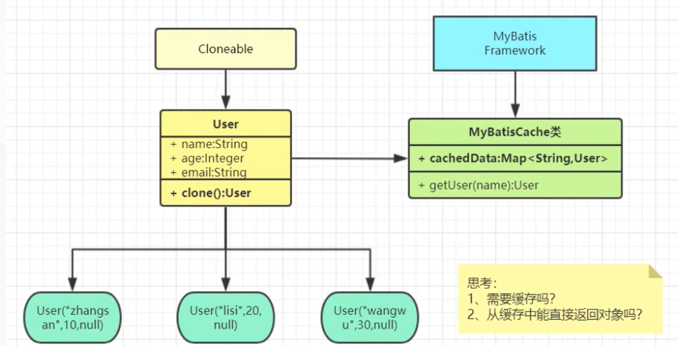

tags:: 设计模式，原型模式

- 
- 用来创建重复的对象，同时又能保证性能
- 案例
	- ```
	  * 1. GuiguMyBatis*：操作数据库，从数据库里面查出很多记录（**70%**改变很少
	  ** 2. *每次查数据库，查到以后把所有数据都封装成一个对象，返回
	  **    10000 thread*：查询同一个记录  **new User("zhangsna", 18), **每次创建一个对象封装并返回
	  **    *系统里面就会有**10000**个**User**，很浪费内存
	  ** 3. *解决：缓存：查过的保存，如果再查相同的记录，拿到缓存起来的那条*
	  ```
	- 创建个User，每次都要去查数据库，会导致每次都要真的去数据库里查，创建不同的对象
	- 创建个缓存Map,如果缓存里有就去拿缓存里的值，这样修改之后，能看到只有第一次去数据库里取值了，其他的时候都没有去新建对象
	- 但是有个问题：如果这时候修改了任何取出来的值，会发现其他的值也相对应的发生了改变
	- 那是因为大家取出来的都是缓存里的这个对象，这个对象里的属性发生了变化，其他引用也会相对应的发生变化的。
	- 这时候引入原型模式！
		- 将对象implement cloneable，标识是可以被克隆的，然后重写clone方法，这个方法可以自己去定义
		- 然后再取出缓存的时候，返回的全都是clone到的数据。 在存入缓存的时候，存入的也是创造之后的clone体。
		- 这样，及时是获取相同的数据，但是互相之间也不会有任何的影响。
- •什么场景用到？
	- 资源优化
	- 性能和安全要求
	- 一个对象多个修改者的场景。
	- 一个对象需要提供给其他对象访问，而且各个调用者可能都需要修改其值时可以考虑使用原型模式拷贝多个对象供调用者使用。
	- 深（两个完全对象不一样的【递归克隆】，内容却完全一样）、浅（只是属性赋值）
	- ....
- 原型模式已经与Java 融为浑然一体，大家可以随手拿来使用。