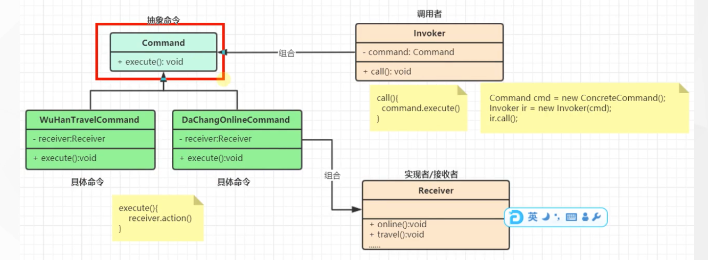

tags:: 设计模式，命令模式

- •命令（Command）模式：将一个请求封装为一个对象，使发出请求的责任和执行请求的责任分割开。这样两者之间通过命令对象进行沟通，这样方便将命令对象进行储存、传递、调用、增加与管理。
- 命令模式包含以下主要角色。
	- 抽象命令类（Command）角色：声明执行命令的接口，拥有执行命令的抽象方法execute()。
	- 具体命令类（Concrete Command）角色：是抽象命令类的具体实现类，它拥有接收者对象，并通过调用接收者的功能来完成命令要执行的操作。
	- 实现者/接收者（Receiver）角色：执行命令功能的相关操作，是具体命令对象业务的真正实现者。
	- 调用者/请求者（Invoker）角色：是请求的发送者，它通常拥有很多的命令对象，并通过访问命令对象来执行相关请求，它不直接访问接收者。
- 
- 调用者发起命令（我
- 抽象命令，遥控器上的那妞
- 具体实现，按1开电视，按2关电视
- 实现者，接受者，电视
- 什么场景用到？
	- mvc就是典型的命令模式
	- 当系统需要执行一组操作时，命令模式可以定义宏命令（一个命令组合了多个命令）来实现该功能。
	- 结合备忘录模式还可以实现命令的撤销和恢复