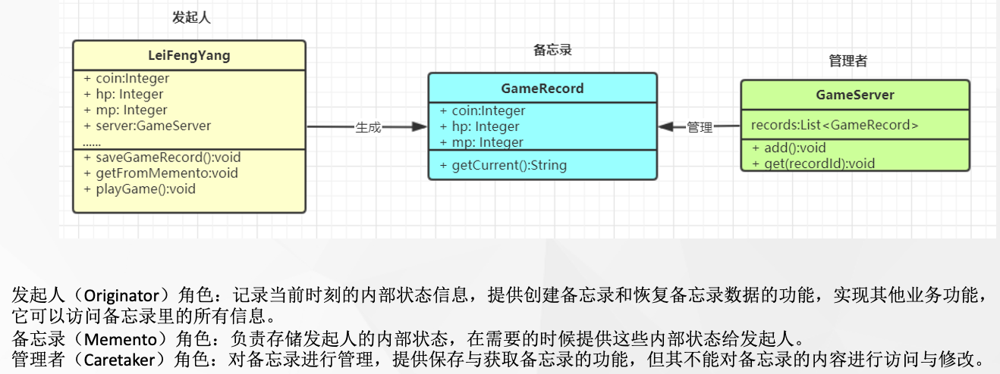

tags:: 设计模式，备忘录模式

- 在不破坏封装性的前提下，捕获一个对象的内部状态，并在该对象之外保存这个状态，以便以后当需要时能将该对象恢复到原先保存的状态。该模式又叫快照模式。对象行为型模式
- 
- 把属性值额外保存到一个地方，要用的时候，拿出来再赋值。很像游戏存档起来哈哈哈哈
- 什么场景用到？
	- 游戏存档
	- 数据库保存点事务（savepoint）
	- session活化钝化