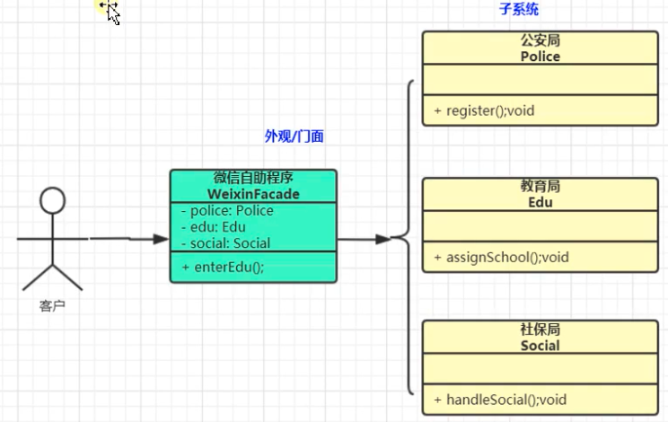

tags:: 设计模式，外观模式

- 外观模式又叫门面模式，是一种通过为多个复杂的子系统提供一个一致的接口，从而使得这些子系统更加容易被访问的模式
- 
- 之前可能是controller里调用10多个service。将这么多service组成个大的service，使用者只需要来这个service就行
- 使用场景
	- 去医院看病，可能要去挂号、门诊、划价、取药，让患者或患者家属觉得很复杂，如果有提供接待人员，只让接待人员来处理，就很方便。以此类比......
	- JAVA 的三层开发模式。
	- 分布式系统的网关
	- Tomcat源码中的RequestFacade干什么的？