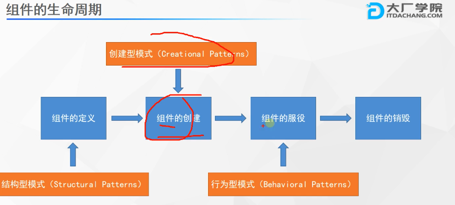

tags:: 设计模式

- 分类：
	- 创建型模式
		- 单例模式
		- 原型模式
		- 工厂方法模式
		- 抽象工厂模式
		- 建造者模式
	- 结构型模式
		- 代理模式
		- 适配器模式
		- 桥接模式
		- 装饰模式
		- 外观模式
		- 享元模式
		- 组合模式
		- 过滤器模式
	- 行为型模式
		- 模版方法模式
		- 策略模式
		- 命令模式
		- 责任链模式
		- 状态模式
		- 观察者模式
		- 中介者模式
		- 迭代器模式
		- 访问者模式
		- 备忘录模式
		- 解释器模式
- 设计模式原则
	- 对接口编程而不是实现编程
	- 优先使用对象组合而不是继承
- 设计模式的基石
	- 封装
	- 继承
	- 多态
	- 顺序
	- 判断
	- 循环
- 组件的生命周期
	- 
	- 组件定义的时候用结构型模式
	- 组件定义完了，要创建一个组件的对象，用创建型模式
	- 方法调用，使用的时候，用行为型模式
- 设计模式的7大原则
	- 开闭原则
		- 软件实体对扩展开放，对修改关闭
		- 扩展新类而不是修改旧类
		- A1不太适用了，可以扩展出来一个A2来适配当前的环境，而不是在A1中修改
	- 里氏替换原则
		- 继承必须保证超类拥有的性质在子类中仍然成立
		- 继承父类而不去改变父类
		- 不要去重写父类的方法而是应该去改变一些父类让我们去扩展的方法
		- 保证子类和父类是可以互相替换的
	- 依赖倒置原则
		- 高层模块不应该依赖底层模块，两者都应该依赖抽象。抽象不应该依赖细节，细节应该依赖抽象
		- 面向接口编程，而不是面向实现类
	- 单一职责原则
		- 一个类应该有且仅有一个引起它变化的原因，否则类应该被拆分
		- 每个类只负责自己的事情，而不是变成万能
		- 这个负责链接数据库，那个负责增删改查，这种粒度的
	- 接口隔离原则
		- 一个类对另一个类的依赖应该建立在最小的接口上
		- 各个类建立自己的专用接口，而不是建立万能接口
	- 迪米特法则，最少知识原则
		- 无需直接交互的两个类，如果需要交互，用中间者
		- 可能会导致产生大量中介类，增加系统复杂度，使模块之间的通信效率降低
	- 合成复用原则
		- 优先组合，其次继承
- 创建型模式
	-