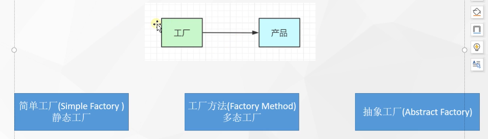
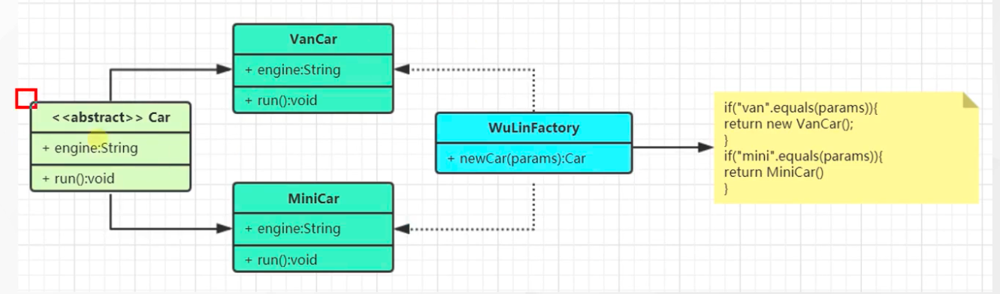
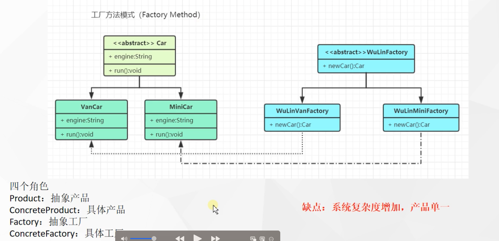
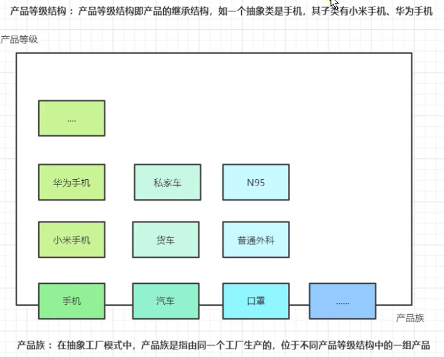
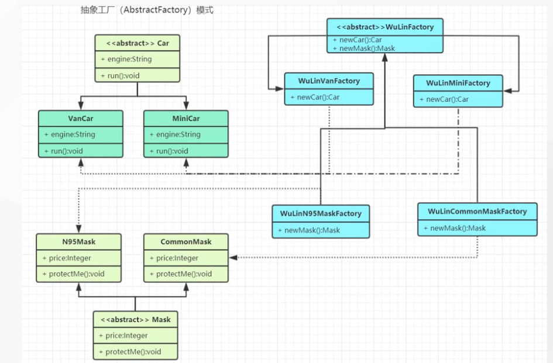

tags:: 设计模式，工厂模式

- 工厂模式，提供了一种创建对象的最佳方式。不必关系对象创建的细节，只需要根据不同情况获取不同产品即可。
- 
- 简单工厂
	- 
	- 先定义一个抽象的产品，拥有的属性和行为
	- 然后定义两个不同的具体产品，vanCar和miniCar，定义好这两个产品的具体的属性和行为
	- 定义一个工厂，简单工厂是静态的，就是说，你要已知有哪些具体的产品，根据类型，去创建出不同的具体的产品，在工厂里进行返回。
	- 他比较适合比较简单的，只有几种产品的场景
	- 缺点，如果再有更多的产品需要创建，又要修改工厂方法，其实违背了开闭原则，还要去修改那个if else判断，其实应该直接扩展出一个类来造
	- 如果入参是一个class对象，反射调用方法，但是如果是复杂对象的话，还是无法满足
- 工厂方法模式
	- 
	- 每种具体的产品都有一个对应的具体工厂来进行生产
	- 遵循了开闭原则，增加了一个新的产品的时候，就会对应的创建一个新的工厂来生产这个产品
	- 缺点：系统复杂度增加，产品单一。如果想要造口罩，那现在都不符合了，又要定义抽象工厂，很麻烦
- 抽象工厂
	- 
	- 
	- 好处就是，如果扩展其他业务线，只需要对抽象类做扩展就行了
- 退化
	- •当抽象工厂模式中**每一个具体工厂类只创建一个产品对象**，也就是只存在一个产品等级结构时，**抽象工厂模式退化成工厂方法模式**；当工厂方法模式中抽象工厂与具体工厂合并，提供一个统一的工厂来创建产品对象，并将创建对象的工厂方法设计为静态方法时，**工厂方法模式退化成简单工厂模式**。
- 使用场景
	- NumberFormat、SimpleDateFormat
	- LoggerFactory：
	- SqlSessionFactory：MyBatis
	- BeanFactory：Spring的BeanFactory（就是为了造出bean）
	- ......
-
-
- 各种口味的pizza
	- 披萨店，要有个简单工厂，有个披萨类，里面有很多接口的实现类，每个实现类都对应一种pizza
	- 工厂类里，if else a种类就定义的是某个子类
	- 但是简单工厂里都是用if else，如果种类太多了的话，不太好
	- 工厂方法模式
		- 定义了一个创建对象的接口，由子类决定要实例化的类是哪一个，工厂方法把实例化推迟到子类
		- 不同地区的工厂
		- pizzastore 是个抽象类，createPizza，不同地区实现一个createPizza的方法
		- new的时候就是不同地区的店
		- 更复杂的
			- 组装手机，多个流水线来组装
			- 抽象工厂模式
				- 提供一个接口，创建相关或依赖对象的家族，不需要明确指定具体类
				- 工厂方法：通过抽象方法提供对象生成入口
				- 抽象工厂：通过接口创建一组产品
			-