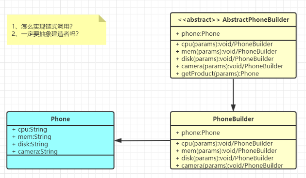

tags:: 设计模式，建造者模式

- 
- 产品角色（Product）：Phone
- 抽象建造者（Builder）：AbstracPhoneBuilder
- 具体建造者(Concrete Builder）：PhoneBuilder
- 创建的东西细节复杂，还必须暴露给使用者。屏蔽过程而不屏蔽细节
- 什么场景用到？
	- StringBuilder：append();给谁append呢？
	- Swagger-ApiBuilder：
	- 快速实现。Lombok-Builder模式