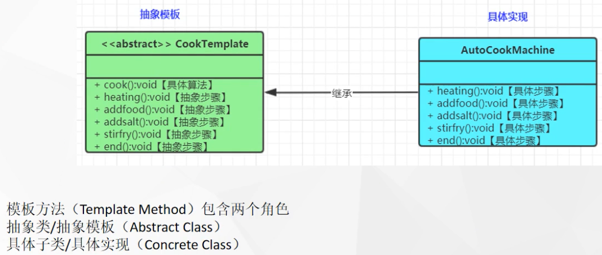

tags:: 设计模式，模版方法模式

- 一个抽象类公开定义了执行它的方法的方式模版
- 子类可以按需要重写方法实现，但是调用将以抽象类中定义的方式进行
- 
- 在抽象类里定义了一个方法，方法里是各个方法步骤的调用过程，先加油，后饭菜，后炒菜，后加盐，最后盛出来。
- 但是你可以某些步骤，比如放菜和加盐，你可以自己在具体实现里定义，加啥菜，放多少盐
- 最后使用的时候，一定是调用抽象模版里的那个做菜方法。在抽象类里定义具体流程
- 什么场景用到？
	- Spring的整个继承体系都基本用到模板方法
	- JdbcTemplate、RedisTemplate都允许我们再扩展.....
	- 我们自己的系统也应该使用模板方法组织类结构