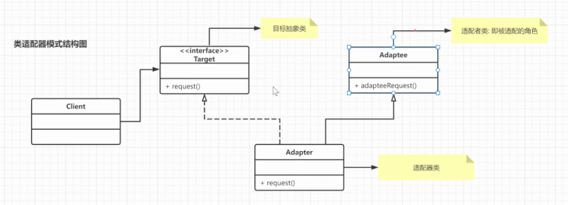

- 代理模式
	- 由于一些原因，客户端不想或者不能直接访问一个对象，可以通过一个 代理 来实现间接访问
	- 定义
		- 提供对象的替代品或者占位符，代理控制原对象的访问，允许将请求提交给对象前后进行一些处理
	- 结构
		- 
		- 抽象主题 subject类 声明了真实主题和代理主题的共同接口
		- realSubject 真实主题类 是代理对象所代表的真实对象，也是最终要引用的对象
		- 代理类 Proxy 实现了抽象主题中的具体业务，内部是包含对真实主题的引用
	- 静态代理
		- 可以在不修改目标类的前提下，扩展目标类的功能
		- 缺点:
			- 冗余 代理对象要实现和目标对象一致的接口，会产生很多代理
			- 不容易维护，一旦接口中增加方法，目标对象和代理对象都要修改
	- jdk动态代理
		- 静态代理与动态代理的区别:
			- 1. 静态代理在编译时就已经实现了,编译完成后代理类是一个实际的class文件
			- 2. 动态代理是在运行时动态生成的,即编译完成后没有实际的class文件,而是在运行时动态生成类字节码,并加载到JVM中.
		- 类是如何动态生成的
			- 加载 验证 准备 解析 初始化
			- 加载的时候
				- 通过类的全限定名名获取定义这个类的二进制字节流
					- 本地获取
					- 网络获取
					- 运行时计算生成   动态生成！ 根据接口或者目标对象，计算出代理类的字节码，加载到jvm中使用
				- 将字节流代表的静态存储结构转换成方法区的运行时数据结构
				- 内存中生成一个代表这个类的class文件，作为方法区这个类的各种数据访问入口
		- 代理类的调用过程
			- ```
			  
			  - 动态代理类对象 继承了 Proxy 类，并且实现了被代理的所有接口，以及equals、hashCode、toString等方法
			  
			  - 代理类的构造函数，参数是`InvocationHandler`实例，`Proxy.newInstance`方法就是通过这个构造函数来创建代理实例的
			  
			  - 类和所有方法都被 `public final` 修饰，所以代理类只可被使用，不可以再被继承
			  
			  - 每个方法都有一个 Method 对象来描述，Method 对象在static静态代码块中创建，以 `m + 数字` 的格式命名
			  
			  - 调用方法的时候通过 `this.h.invoke(this, m3, null));`  **实际上 h.invoke就是在调用ProxyFactory中我们重写的invoke方法**  
			  
			    ```
			- ```
			  @Override
			    public Object invoke(Object proxy, Method method, Object[] args) throws Throwable {
			  
			        System.out.println("开启事务");
			        //执行目标对象方法
			        method.invoke(target, args);
			        System.out.println("提交事务");
			        return null;
			  
			    }
			  ```
	- cglib动态代理
		- cglib (Code Generation Library ) 是一个第三方代码生成类库，运行时在内存中动态生成一个子类对象从而实现对目标对象功能的扩展。cglib 为没有实现接口的类提供代理，为JDK的动态代理提供了很好的补充。
			- 最底层是字节码
			- ASM是操作字节码的工具
			- cglib基于ASM字节码工具操作字节码（即动态生成代理，对方法进行增强）
			- SpringAOP基于cglib进行封装，实现cglib方式的动态代理
			- 
		- 代理对象例子
			- ```java
			  
			  public class UserLogProxy implements MethodInterceptor {
			  
			      private Object target;
			  
			      public UserLogProxy(Object target) {
			  
			          this.target = target;
			  
			      }
			  
			      public Object getLogProxy(){
			  
			          //增强器类,用来创建动态代理类
			  
			          Enhancer en = new Enhancer();
			  
			          //设置代理类的父类字节码对象
			  
			          en.setSuperclass(target.getClass());
			  
			          //设置回调: 对于代理类上所有的方法的调用,都会调用CallBack,而Callback则需要实现intercept()方法进行拦截
			  
			          en.setCallback(this);
			  
			          //创建动态代理对象并返回
			  
			          return en.create();
			  
			      }
			  
			      /**
			  
			       * 实现回调方法
			  
			       * @param o     代理对象
			  
			       * @param method  目标对象中的方法的Method实例
			  
			       * @param args      实际参数
			  
			       * @param methodProxy  代理对象中的方法的method实例
			  
			       * @return: java.lang.Object
			  
			       */
			  
			      @Override
			  
			      public Object intercept(Object o, Method method, Object[] args,
			  
			                              MethodProxy methodProxy) throws Throwable {
			  
			          Calendar calendar = Calendar.getInstance();
			  
			          SimpleDateFormat formatter = new SimpleDateFormat("yyyy-MM-dd HH:mm:ss");
			  
			          System.out.println(formatter.format(calendar.getTime()) + " [" +method.getName() + "] 查询用户信息...]");
			  
			          Object result = methodProxy.invokeSuper(o, args);
			  
			          return result;
			  
			      }
			  
			  }
			  
			  ```
			- ```
			  public class Client {
			  
			      public static void main(String[] args) {
			  
			          //目标对象
			          UserServiceImpl userService = new UserServiceImpl();
			          System.out.println(userService.getClass());
			  
			          //代理对象
			          UserServiceImpl proxy = (UserServiceImpl) new UserLogProxy(userService).getLogProxy();
			          System.out.println(proxy.getClass());
			  
			          List<User> userList = proxy.findUserList();
			          System.out.println("用户信息: "+userList);
			      }
			  }
			  ```
		- cglib代理流程
			- 
	- 三种代理模式对比
		- jdk代理和CGLIB代理
			- 使用CGLib实现动态代理，CGLib底层采用ASM字节码生成框架，使用字节码技术生成代理类，在JDK1.6之前比使用Java反射效率要高。唯一需要注意的是，CGLib不能对声明为final的类或者方法进行代理，因为CGLib原理是动态生成被代理类的子类。
			- 在JDK1.6、JDK1.7、JDK1.8逐步对JDK动态代理优化之后，在调用次数较少的情况下，JDK代理效率高于CGLib代理效率，只有当进行大量调用的时候，JDK1.6和JDK1.7比CGLib代理效率低一点，但是到JDK1.8的时候，JDK代理效率高于CGLib代理。所以如果有接口使用JDK动态代理，如果没有接口使用CGLIB代理。
		- 动态代理和静态代理
			- 动态代理与静态代理相比较，最大的好处是接口中声明的所有方法都被转移到调用处理器一个集中的方法中处理（InvocationHandler.invoke）。这样，在接口方法数量比较多的时候，我们可以进行灵活处理，而不需要像静态代理那样每一个方法进行中转。
			- 如果接口增加一个方法，静态代理模式除了所有实现类需要实现这个方法外，所有代理类也需要实现此方法。增加了代码维护的复杂度。而动态代理不会出现该问题
		- 优缺点
			- **优点：**
				- 代理模式在客户端与目标对象之间起到一个中介作用和保护目标对象的作用；
				- 代理对象可以扩展目标对象的功能；
				- 代理模式能将客户端与目标对象分离，在一定程度上降低了系统的耦合度；
			- 缺点
				- 增加了系统的复杂度；
		- 使用场景
			- 功能增强 ：当需要对一个对象的访问提供一些额外操作时,可以使用代理模式
			- 远程（Remote）代理
				- 实际上，RPC 框架也可以看作一种代理模式，GoF 的《设计模式》一书中把它称作远程代理。通过远程代理，将网络通信、数据编解码等细节隐藏起来。客户端在使用 RPC 服务的时候，就像使用本地函数一样，无需了解跟服务器交互的细节。除此之外，RPC 服务的开发者也只需要开发业务逻辑，就像开发本地使用的函数一样，不需要关注跟客户端的交互细节
			- 防火墙（Firewall）代理
				- 当你将浏览器配置成使用代理功能时，防火墙就将你的浏览器的请求转给互联网；当互联网返回响应时，代理服务器再把它转给你的浏览器。
			- 保护（Protect or Access）代理
				- 控制对一个对象的访问，如果需要，可以给不同的用户提供不同级别的使用权限。
- 桥接模式
	- 桥接模式(bridge pattern) 的定义是：将抽象部分与它的实现部分分离，使它们都可以独立地变化。
	- 桥接模式用一种巧妙的方式处理多层继承存在的问题,用抽象关联来取代传统的多层继承,将类之间的静态继承关系转变为动态的组合关系,使得系统更加灵活,并易于扩展,有效的控制了系统中类的个数 (避免了继承层次的指数级爆炸).
	- 将两个独立的变化维度进行解耦，不是讲两者耦合在一起，形成多层继承的结构
	- 原理
		- 桥接（Bridge）模式包含以下主要角色：
			- 抽象化（Abstraction）角色 ：主要负责定义出该角色的行为 ,并包含一个对实现化对象的引用。
			- 扩展抽象化（RefinedAbstraction）角色 ：是抽象化角色的子类，实现父类中的业务方法，并通过组合关系调用实现化角色中的业务方法。
			- 实现化（Implementor）角色 ：定义实现化角色的接口，包含角色必须的行为和属性,并供扩展抽象化角色调用。
			- 具体实现化（Concrete Implementor）角色 ：给出实现化角色接口的具体实现。
		- 
		- 
		- 首先有要识别出一个类所具有的的两个独立变化维度,将它们设计为两个独立的继承等级结构,为两个维度都提供抽象层,并建立抽象耦合.总结一句话就是: 抽象角色引用实现角色
		- 实体与行为的分离
	- 总结
		- **桥接模式的优点:**
			- 1. 分离抽象接口及其实现部分.桥接模式使用"对象间的关联关系"解耦了抽象和实现之间固有的绑定关系,使得抽象和实现可以沿着各自的维度来变化.
			- 2. 在很多情况下,桥接模式可以取代多层继承方案.多层继承方案违背了单一职责原则,复用性差,类的个数多.桥接模式很好的解决了这些问题.
			- 3. 桥接模式提高了系统的扩展性,在两个变化维度中任意扩展一个维度都不需要修改原有系统,符合开闭原则.
		- **桥接模式的缺点:**
			- 1. 桥接模式的使用会增加系统的理解和设计难度,由于关联关系建立在抽象层,要求开发者一开始就要对抽象层进行设计和编程
			- 2. 桥接模式要求正确识别出系统中的两个独立变化的维度,因此具有一定的局限性,并且如果正确的进行维度的划分,也需要相当丰富的经验.
		- **桥接模式使用场景**
			- 1. 需要提供平台独立性的应用程序时。 比如，不同数据库的 JDBC 驱动程序、硬盘驱动程序等。
			- 2. 需要在某种统一协议下增加更多组件时。 比如，在支付场景中，我们期望支持微信、支付宝、各大银行的支付组件等。这里的统一协议是收款、支付、扣款，而组件就是微信、支付宝等。
			- 3. 基于消息驱动的场景。 虽然消息的行为比较统一，主要包括发送、接收、处理和回执，但其实具体客户端的实现通常却各不相同，比如，手机短信、邮件消息、QQ 消息、微信消息等。
			- 4. 拆分复杂的类对象时。 当一个类中包含大量对象和方法时，既不方便阅读，也不方便修改。
			- 5. 希望从多个独立维度上扩展时。 比如，系统功能性和非功能性角度，业务或技术角度等。
- 装饰器模式
	- 装饰模式(decorator pattern) 的原始定义是：动态的给一个对象添加一些额外的职责. 就扩展功能而言,装饰器模式提供了一种比使用子类更加灵活的替代方案.
	- 在软件设计中,装饰器模式是一种用于替代继承的技术,它通过一种无须定义子类的方式给对象动态的增加职责,使用对象之间的关联关系取代类之间的继承关系.
	- 原理
		- 
		- 装饰（Decorator）模式中的角色：
			- 抽象构件（Component）角色 ：它是具体构件和抽象装饰类的共同父类,声明了在具体构件中实现的业务方法.它引进了可以使客户端以一致的方式处理未被装饰的对象以及装饰之后的对象,实现客户端的透明操作
			- 具体构件（Concrete  Component）角色 ：它是抽象构件类的子类,用于定义具体的构建对象,实现了在抽象构建中声明的方法,装饰类可以给它增加额外的职责(方法).
			- 抽象装饰（Decorator）角色 ：它也是抽象构件类的子类,用于给具体构件增加职责,但是具体职责在其子类中实现.它维护了一个指向抽象构件对象的引用,通过该引用可以调用装饰之前构件对象的方法,并通过其子类扩展该方法,以达到装饰的目的.
			- 具体装饰（ConcreteDecorator）角色 : 它是抽象装饰类的子类,负责向构件添加新的职责.每一个具体装饰类都定义了一些新的行为,它可以调用在抽象装饰类中定义的方法,并可以增加新的方法用于扩充对象的行为.
	- 总结
		- **装饰器模式的优点:**
			- 1. 对于扩展一个对象的功能,装饰模式比继承更加灵活,不会导致类的个数急剧增加
			- 2. 可以通过一种动态的方式来扩展一个对象的功能,通过配置文件可以在运行时选择不同的具体装饰类,从而实现不同的行为.
			- 3. 可以对一个对象进行多次装饰,通过使用不同的具体装饰类以及这些装饰类的排列组合可以创造出很多不同行为的组合,得到更加强大的对象.
			- 4. 具体构建类与具体装饰类可以独立变化,用户可以根据需要增加新的具体构建类和具体装饰类,原有类库代码无序改变,符合开闭原则.
		- **装饰器模式的缺点:**
			- 1. 在使用装饰模式进行系统设计时将产生很多小对象,这些对象的区别在于它们之间相互连接的方式有所不同,而不是它们的类或者属性值不同,大量的小对象的产生势必会占用更多的系统资源,在一定程度上影响程序的性能.
			- 2. 装饰器模式提供了一种比继承更加灵活、机动的解决方案,但同时也意味着比继承更加易于出错,排错也更加困难,对于多次装饰的对象,在调试寻找错误时可能需要逐级排查,较为烦琐.
		- **装饰器模式的适用场景**
			- 1. 快速动态扩展和撤销一个类的功能场景。 比如，有的场景下对 API 接口的安全性要求较高，那么就可以使用装饰模式对传输的字符串数据进行压缩或加密。如果安全性要求不高，则可以不使用。
			- 2. 不支持继承扩展类的场景。 比如，使用 final 关键字的类，或者系统中存在大量通过继承产生的子类。
- 适配器模式
	- 将类的接口转换成客户期望的另外一个接口，适配器可以让不兼容的两个类一起协同工作
	- 方式
		- 类适配器 用继承实现 耦合度高
		- 对象适配器 用组合实现
	- 类适配器模式结构图
		- 适配器模式（Adapter）包含以下主要角色：
			- 目标（Target）接口：当前系统业务所期待的接口，它可以是抽象类或接口。
			- 适配者（Adaptee）类：适配者即被适配的角色,它是被访问和适配的现存组件库中的组件接口。
			- 适配器（Adapter）类：它是一个转换器，通过继承或引用适配者的对象，把适配者接口转换成目标接口，让客户按目标接口的格式访问适配者。
		- 
		- 
	- 类适配器实现
		- SDAdpaterTF extends TFCardImpl implements SDCard
			- 表面上实现的是SDcard的接口，但是实际上里面调用的是TFcard的实现
	- 对象适配器模式实现
		- implements SDCard
		- 里面有个属性是TFCard
	- 总结
		- 优点
			- 1. 将目标类和适配者类解耦,通过引入一个适配器类来重用现有的适配者类,无序修改原有结构
			  2. 增加了类的透明性和复用性,将具体业务实现过程封装在适配者类中,对于客户端类而言是透明的,而且提高了适配者的复用性,同一个适配者类可以在多个不同的系统中复用.
			  3. 灵活性和扩展性都非常好,通过使用配置文件可以很方便的更换适配器,也可以在不修改原有代码的基础上增加新的适配器类,符合开闭原则.
		- 缺点
			- 类适配器的缺点
			  
			  1. 对于Java等不支持多重继承的语言,一次最多只能适配一个适配者类,不能同时适配多个适配者
			  
			  2. 适配者类不能为最终类
			- 对象适配器的缺点
			  
			  1. 与类适配器模式相比较,在该模式下要在适配器中置换适配者类的某些方法比较麻烦.
		- 适配器模式适用的场景
			- 统一多个类的接口设计时
			  
			  > 某个功能的实现依赖多个外部系统（或者说类）。通过适配器模式，将它们的接口适配为统一的接口定义
			- 需要依赖外部系统时
			  
			  > 当我们把项目中依赖的一个外部系统替换为另一个外部系统的时候，利用适配器模式，可以减少对代码的改动
			- 原有接口无法修改时或者原有接口功能太老旧但又需要兼容；
			  
			  > JDK1.0 Enumeration 到 Iterator 的替换,适用适配器模式保留 Enumeration 类，并将其实现替换为直接调用 Itertor.
			- 适配不同数据格式时；
			  
			  > Slf4j 日志框架,定义打印日志的统一接口,提供针对不同日志框架的适配器
		- **代理、桥接、装饰器、适配器 4 种设计模式的区别****
			- 代理模式：代理模式在不改变原始类接口的条件下，为原始类定义一个代理类，主要目的是控制访问，而非加强功能，这是它跟装饰器模式最大的不同。
			- 桥接模式：桥接模式的目的是将接口部分和实现部分分离，从而让它们可以较为容易、也相对独立地加以改变。
			- 装饰器模式：装饰者模式在不改变原始类接口的情况下，对原始类功能进行增强，并且支持多个装饰器的嵌套使用。
			- 适配器模式：将一个类的接口转换为客户希望的另一个接口.适配器模式让那些不兼容的类可以一起工作.
- 外观模式
	- 外观模式( Facade Pattern)，也叫门面模式, 外观模式的原始定义是：为子系统中的一组接口提供统一的接口。它定义了一个更高级别的接口，使子系统更易于使用。
	- 外观模式，是一种通过为多个复杂的子系统提供一个一致的接口，而使这些子系统更加容易被访问的模式。该模式对外有一个统一接口，外部应用程序不用关心内部子系统的具体的细节，这样会大大降低应用程序的复杂度，提高了程序的可维护性。
	- 
	- 门面类充当了系统中的"服务员",它为多个业务类的调用提供了一个统一的入口,简化了类与类之间的交互,如果没有门面类,每个客户类需要和多个子系统之间进行复杂的交互,系统的耦合度将会很大.
	- 原理
		- 外观（Facade）角色：为多个子系统对外提供一个共同的接口。
		  
		    > 外观角色中可以知道多个相关的子系统中的功能和责任.在正常情况下,它将所有从客户端发来的请求委派到相应的子系统,传递给相应的子系统对象处理
		- 子系统（Sub System）角色：实现系统的部分功能，客户可以通过外观角色访问它。
		  
		    > 每一个子系统可以是一个类也可以是多个类的集合.每一个子系统都可以被客户端直接调用,或者被外观角色调用.子系统并不    知道外观的存在,对于子系统而言,外观角色仅仅是另一个客户端而已.
		- 
	- 总结
		- **外观模式的优点:**
			- 它对客户端屏蔽了子系统组件,减少了客户端所需要处理的对象数目,并使子系统使用起来更加的容易.通过引入外观模式,客户端代码将变得很简单,与之关联的对象也很少.
			- 它实现了子系统与客户端之间的松耦合关系,这使得子系统的变化不会影响到调用它的客户端,只需要调整外观类即可
			- 一个子系统的修改对其他子系统没有任何影响,而子系统内部变化也不会影响到外观对象.
		- 外观模式缺点:
			- 不能很好的控制客户端直接使用子系统类,如果客户端访问子系统类做太多的限制则减少了可变性和灵活性.
			- 如果设计不当,增加新的子系统可能需要修改外观类的源代码,违背了开闭原则.
		- 使用场景分析
			- 简化复杂系统。 比如，当我们开发了一整套的电商系统后（包括订单、商品、支付、会员等系统），我们不能让用户依次使用这些系统后才能完成商品的购买，而是需要一个门户网站或手机 App 这样简化过的门面系统来提供在线的购物功能。
			- 减少客户端处理的系统数量。 比如，在 Web 应用中，系统与系统之间的调用可能需要处理 Database 数据库、Model 业务对象等，其中使用 Database 对象就需要处理打开数据库、关闭连接等操作，然后转换为 Model 业务对象，实在是太麻烦了。如果能够创建一个数据库使用的门面（其实就是常说的 DAO 层），那么实现以上过程将变得容易很多。
			- 让一个系统（或对象）为多个系统（或对象）工作。 比如，线程池 ThreadPool 就是一个门面模式，它为系统提供了统一的线程对象的创建、销毁、使用等。
			- 联合更多的系统来扩展原有系统。 当我们的电商系统中需要一些新功能时，比如，人脸识别，我们可以不需要自行研发，而是购买别家公司的系统来提供服务，这时通过门面系统就能方便快速地进行扩展。
			- 作为一个简洁的中间层。 门面模式还可以用来隐藏或者封装系统中的分层结构，同时作为一个简化的中间层来使用。比如，在秒杀、库存、钱包等场景中，我们需要共享有状态的数据时（如商品库存、账户里的钱），在不改变原有系统的前提下，通过一个中间的共享层（如将秒杀活动的商品库存总数统一放在 Redis 里），就能统一进行各种服务（如，秒杀详情页、商品详情页、购物车等）的调用。
- 组合模式
	-