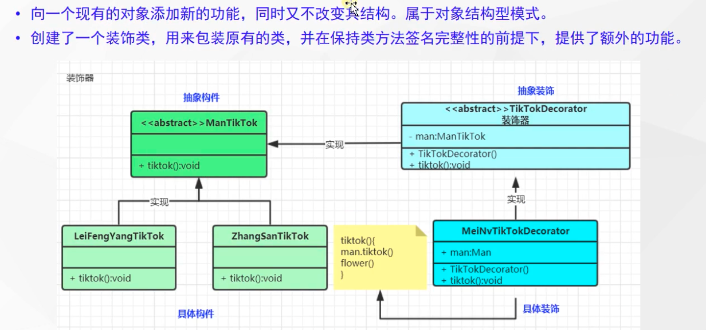

tags:: 设计模式，装饰器模式

- 
- 适配器是连接两个类，可以增强一个类
- 装饰器是增强一个类
- 装饰器使用场景：
	- 什么场景使用？
		- SpringSession中如何进行session与redis关联？HttpRequestWrapper
		- MyBatisPlus提取了QueryWrapper，这是什么？
		- Spring中的BeanWrapper是做什么？
		- Spring Webflux中的 WebHandlerDecorator？