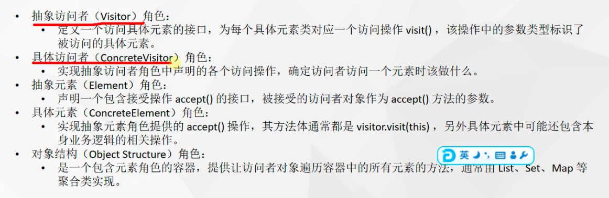
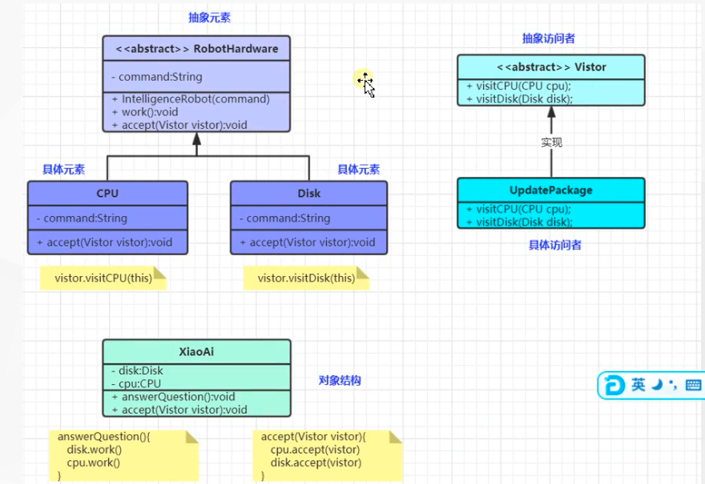

tags:: 设计模式，访问者模式

- 
- 
- 有个小爱机器人，但是现在比较蠢，问一些问题不懂咋回答，要在不改变基本元素的情况下，给他做升级
	- 小爱机器人的定义就是一个对象结构
	- 具体元素就是小爱机器人的cpu，硬盘之类的
	- 抽象元素，就是具体元素继承的抽象类
	- 抽象访问者和具体访问者
- 小爱里的所有disk，cpu需要升级的话，需要在元素抽象方法里，又一个能接受visit的方法，通过这个accept方法，能够接收到扩展的visit对象及方法，对现有的方法进行升级，而不用动原来的老代码
- 角色及映射
	- 抽象访问者（Visitor）角色：定义一个访问具体元素的接口，为每个具体元素类对应一个访问操作
	  visit() ，该操作中的参数类型标识了被访问的具体元素。做增强操作
		- ```
		  public interface Vistor {
		      //访问者能访问元素。
		      void visitDisk(Disk disk);
		      void visitCPU(CPU cpu);
		      void visitFoot(Foot foot);
		  }
		  ```
	- 具体访问者（ConcreteVisitor）角色：实现抽象访问者角色中声明的各个访问操作，确定访问者访问一个元素时该做什么。这样不论我想做哪些增强操作，都可以通过实现这个visitor来进行实现
		- ```
		  public class UpdatePackage implements Vistor{
		      private String ext;
		      public UpdatePackage(String ext){
		          this.ext = ext;
		      }
		      @Override
		      public void visitDisk(Disk disk) {
		          disk.command += " >>> "+ext;
		      }
		      @Override
		      public void visitCPU(CPU cpu) {
		          //改属性为例
		          cpu.command += ">>>> "+ext;
		          //装饰模式。改方法
		      }
		      @Override
		      public void visitFoot(Foot foot) {
		          foot.command += " >>>> "+ext;
		      }
		  }
		  ```
	- 抽象元素（Element）角色：声明一个包含接受操作accept() 的接口，被接受的访问者对象作为 accept() 方法的参数。
		- ```
		  public  abstract class Hardware {
		      String command;//封装硬件的处理指令
		      public Hardware(String command){
		          this.command = command;
		      }
		      //收到命令以后进行工作
		      abstract public void work();
		      //定义接受软件升级包的方法。这个方法应该具体硬件去实现
		       abstract public void accept(Vistor vistor);
		  }
		  ```
	- 具体元素（ConcreteElement）角色：实现抽象元素角色提供的accept() 操作，其方法体通常都是 visitor.visit(this) ，另外具体元素中可能还包含本身业务逻辑的相关操作。
		- ```
		  public class CPU  extends Hardware{
		      public CPU(String command) {
		          super(command);
		      }
		      @Override
		      public void work() {
		          System.out.println("CPU处理指令："+command);
		      }
		      @Override
		      public void accept(Vistor vistor) {
		          //给升级包提供一个改CPU指令等信息的办法
		          vistor.visitCPU(this);
		      }
		  }
		  ```
	- 对象结构（Object Structure）角色：是一个包含元素角色的容器，提供让访问者对象遍历容器中的所有元素的方法，通常由List、Set、Map 等聚合类实现
		- ```
		  public class XiaoAi {
		      private CPU cpu = new CPU("武汉天气");
		      private Disk disk = new Disk("武汉天气");
		      private Foot foot = new Foot("武汉天气");
		      void answerQuestion(){
		          cpu.work();
		          disk.work();
		          foot.work();
		      }
		      //接受升级包
		      public void acceptUpdate(Vistor aPackage) {
		          //访问模式
		          //升级CPU
		          aPackage.visitCPU(cpu);
		          aPackage.visitDisk(disk);
		          aPackage.visitFoot(foot);
		      }
		  }
		  ```
- 缺点
	- 每次多一个元素，升级包里也要定义一个visitFoot元素，违反了开闭原则
- 应用
	- 在访问者模式中，每增加一个新的元素类，都要在每一个具体访问者类中增加相应的具体操作，这违背了“开闭原则”。
	- 违反依赖倒置原则。访问者模式依赖了具体类，而没有依赖抽象类
	- 破坏封装。访问者模式中具体元素对访问者公布细节，这破坏了对象的封装性
	- 应用于对象结构相对稳定，但其操作算法经常变化的程序。
	- Spring反射工具中的MethodVisitor是什么？