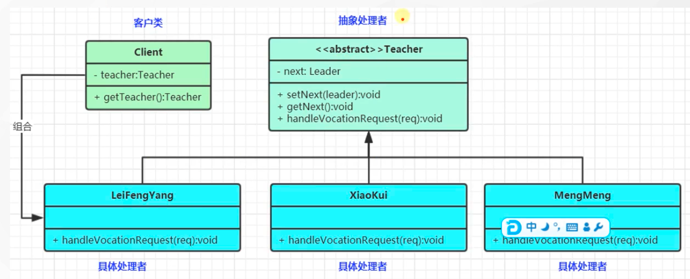

tags:: 设计模式，责任链模式

- 为了避免请求发送者与多个请求处理者耦合在一起，于是将所有请求的处理者通过前一对象记住其下一个对象的引用而连成一条链；当有请求发生时，可将请求沿着这条链传递，直到有对象处理它为止。属于对象行为型模式
- 抽象处理者（Handler）角色：
  id:: 64297045-c9ff-4328-a2c9-8b73f20ba2a6
	- 定义一个处理请求的接口，包含抽象处理方法和一个后继连接。
- 具体处理者（Concrete Handler）角色：
	- 实现抽象处理者的处理方法，判断能否处理本次请求，如果可以处理请求则处理，否则将该请求转给它的后继者。
- 客户类（Client）角色：
	- 创建处理链，并向链头的具体处理者对象提交请求，它不关心处理细节和请求的传递过程。
- 
- 处理
	- 在抽象处理类里，要有next属性，next对象也是个Teacher，这样才是个链。一步步处理，直到结束
-