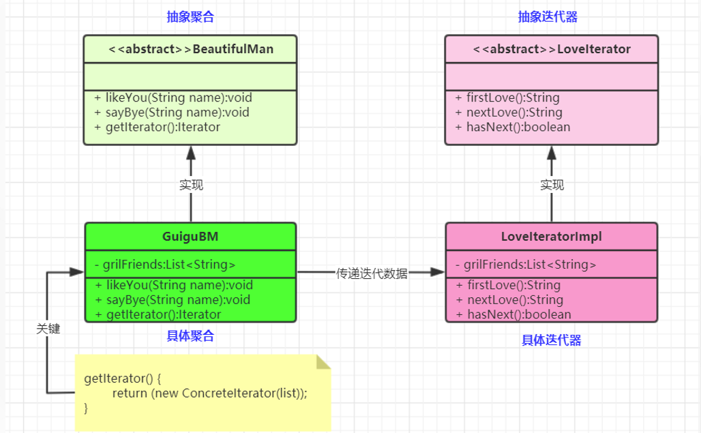

tags:: 设计模式，迭代器模式

- 迭代器（Iterator）模式：提供一个对象(迭代器)来顺序访问聚合对象(迭代数据)中的一系列数据，而不暴露聚合对象的内部表示。对象行为型模式
- 抽象聚合（Aggregate）角色：定义存储、添加、删除聚合对象以及创建迭代器对象的接口。
- 具体聚合（ConcreteAggregate）角色：实现抽象聚合类，返回一个具体迭代器的实例。
- 抽象迭代器（Iterator）角色：定义访问和遍历聚合元素的接口，通常包含hasNext()、first()、next() 等方法。
- 具体迭代器（Concretelterator）角色：实现抽象迭代器接口中所定义的方法，完成对聚合对象的遍历，记录遍历的当前位置。
- 他会把这个list给private隐藏起来，别人来访问的时候，只能一个个的迭代下来问才行
- 
- 定义一个抽象聚合
- 具体的聚合，里面会包含一个list，会包含一个迭代器，已经往list里添加删除元素的方法
- 抽象迭代器，定义迭代器中需要的方法，一般都是下一个， 当前是啥，还有没有下一个
- 具体的迭代器，迭代器的实现，具体聚合里面就会返回这个迭代器，用来迭代这个list
- 什么场景用到？
	- jdk容器接口的Iterator定义
	- 现实开发中，我们几乎无需编写迭代器，基本数据结构链表、树、图的迭代器已经都有了。除非要重写迭代逻辑
-
- next和hasNext  list里面可能有各种不同的实现，但是都定义了hasNext和next方法，这样我们就可以遍历这个list，而不需要关注里面的实际类型