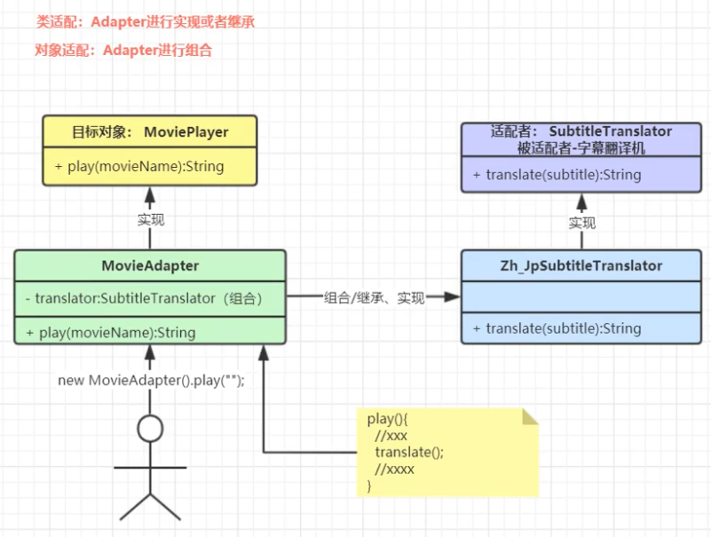
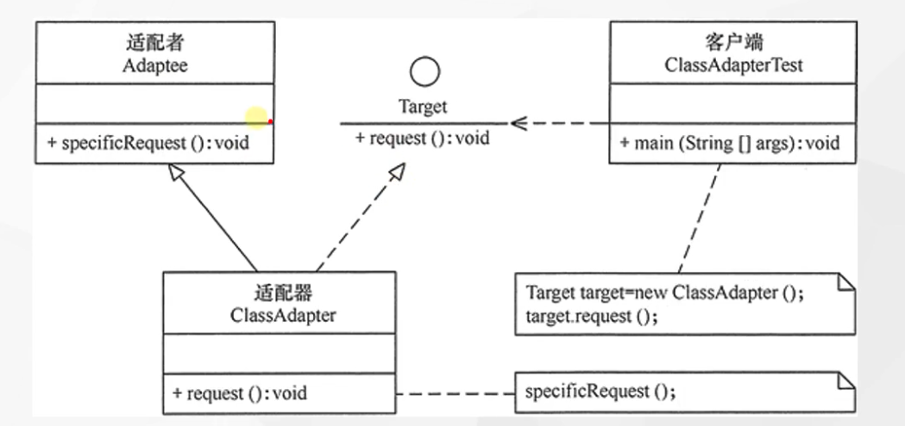
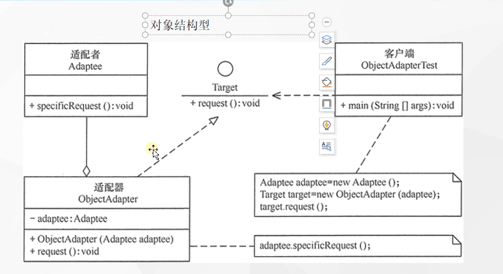

tags:: 设计模式，适配器

- 讲一个接口转换为客户希望的另外一个接口
- 电源适配器那种，国内有220v的，通过适配器，可以转成110v的，让你在国外也能用
- 让接口不兼容的那些类可以一起工作
- 别名：wrapper，包装器
- 包含的角色
	- 目标接口，可以是抽象类或接口，客户希望直接用的接口
	- 适配者类，隐藏的转换接口
	- 适配器类，转换器，通过继承或者引用适配者的对象，把适配者接口转成目标接口
- 
- 例子
	- 有一个电影播放器，输出的是中文的字幕。有个日本人想看，但是看不懂中文，让他观看movieAdapter，movieAdapter可以利用字幕翻译机来将中文字幕翻译成日文字幕。
	- ```
	  *系统原来存在的所有接口都不能动，扩展一个新的类，来连接两个之前不同的类*
	  ```
- 
- 
- 什么场景用到？
	- Tomcat如何将Request流转为标准Request
		- tomcat包下的request。真正的request是servlet的request接口
		- 适配器，coyoteAdaptor，把tomcat转成标准的servletrequest
	- Spring AOP中的AdvisorAdapter是什么
		- 增强器的适配器
		- 前置，后置，返回，结束。advisor通知方法
		- 底层真的目标方法
	- Spring MVC中经典的HandlerAdapter是什么
		- 处理器的适配器
	- SpringBoot 中 WebMvcConfigurerAdapter为什么存在又取消