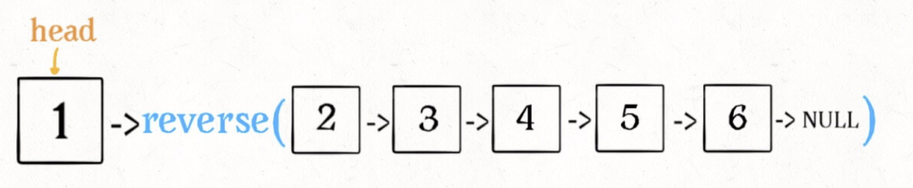
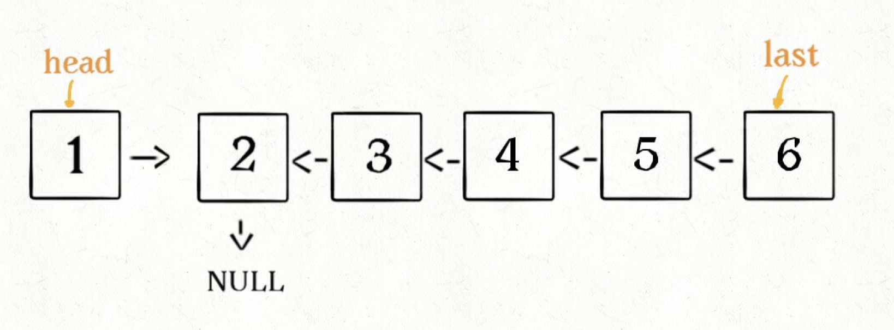

tags:: 递归，链表，算法秘籍

- TODO 复习
  SCHEDULED: <2022-11-19 Sat>
-
- 基本思路
	- 先写出基本的解法，当运行到最后的时候，如何退出
	- 依次向后循环调用
	- 写出后一个节点调用得到结果之后，应该怎么和现在这个节点进行关联的逻辑关系
- 题目
	- 反转一个链表
		- ```
		  class Solution {
		      public ListNode reverseList(ListNode head) {
		      	// 如果head为空或者链表只有一个元素，那不用额外执行翻转逻辑，直接返回head就行了
		          if(head == null || head.next == null) {
		              return head;
		          }
		          // 继续翻转后面的元素
		          ListNode last = reverseList(head.next);
		          // 后面的元素翻转完，回到head的这一层，要如何关联呢？
		          // 将head.next（2）的next指向自己，然后将head.next重置为2
		          // 最后返回last
		          head.next.next = head;
		          head.next = null;
		          return last;
		      }
		  }
		  ```
- 
- 
- 进阶题：翻转一个链表的前K的元素
	- 思路：和反转一整个链表的区别是，只翻转前K个元素，所以当K==1的时候，表示已经翻转到最后一个了，就把head反转回去。
	- 其实就是把前K个元素当做一个完整的链表，进行翻转。除了判断条件从head==null或head.next == null变成了k==1，还有个变化就是，这个小链表反转过来了之后，还要和后面m-k个元素关联起来，所以记录个successor节点，到最后head这一层的时候，head.next 就是这个节点
		- ```
		  	ListNode successor = null;
		      ListNode reverseN(ListNode head, int right) {
		          if(right == 1) {
		              successor = head.next;
		              return head;
		          }
		          ListNode last = reverseN(head.next, right - 1);
		          head.next.next = head ;
		          head.next = successor;
		          return last;
		      }
		  ```
	- 注意点：这个successor的定义一定要在外面，不然在head这一层的时候，successor的值是null
- 进阶题2，反转一个链表从m-n的元素
	- 思路：其实就是从head开始往后挪m个元素，使得在m这个元素的时候，挪动从m开始前m-n个元素
	- ```
	  class Solution {
	      public ListNode reverseBetween(ListNode head, int left, int right) {
	          // 如果left为1的话，就会退化成求反转列表前n个元素的问题
	          if(left == 1) {
	              return reverseN(head, right);
	          }
	          head.next = reverseBetween(head.next, left - 1, right - 1);
	          return head;
	      }
	  
	      ListNode successor = null;
	      ListNode reverseN(ListNode head, int right) {
	          if(right == 1) {
	              successor = head.next;
	              return head;
	          }
	          ListNode last = reverseN(head.next, right - 1);
	          head.next.next = head ;
	          head.next = successor;
	          return last;
	      }
	  }
	  ```