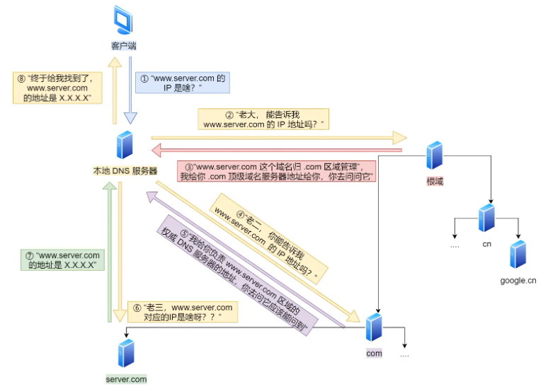
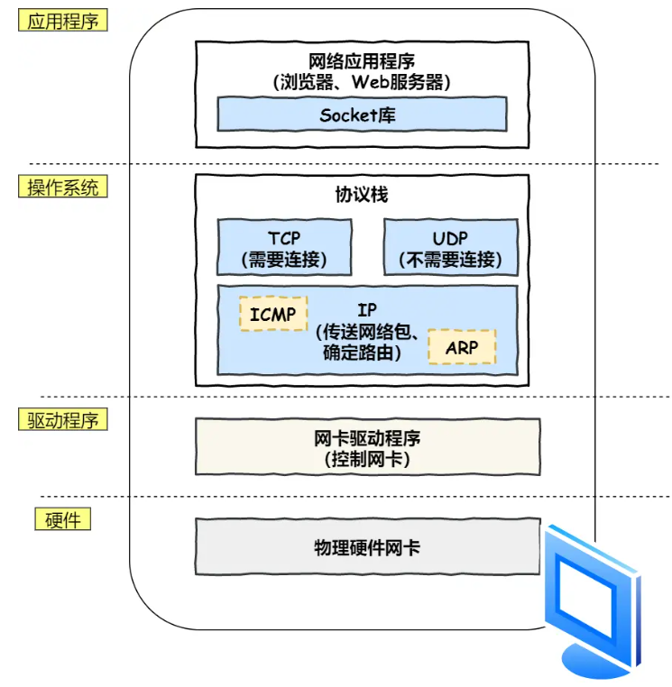
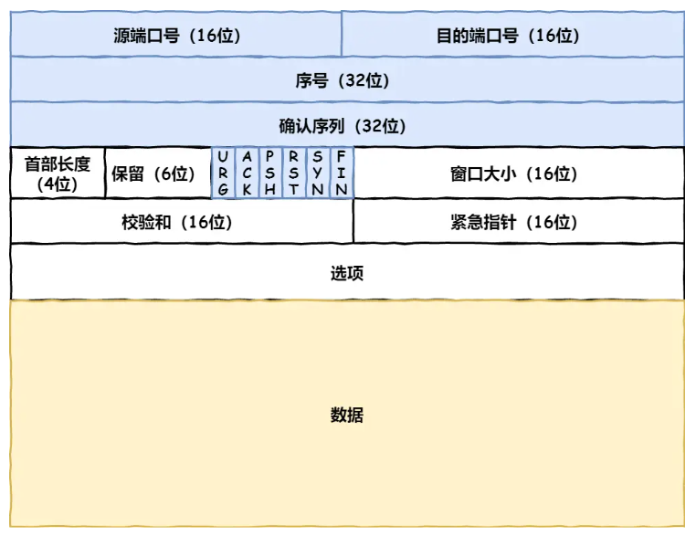
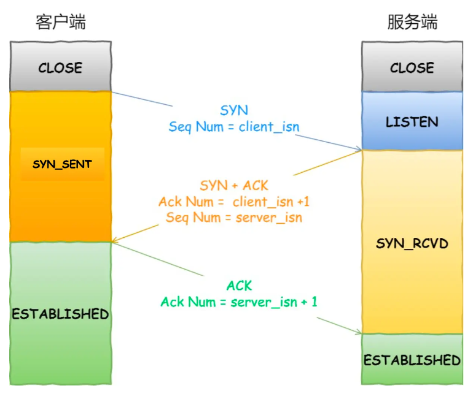
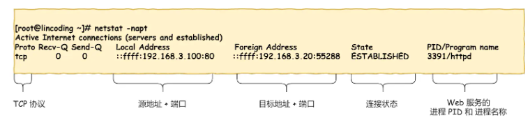
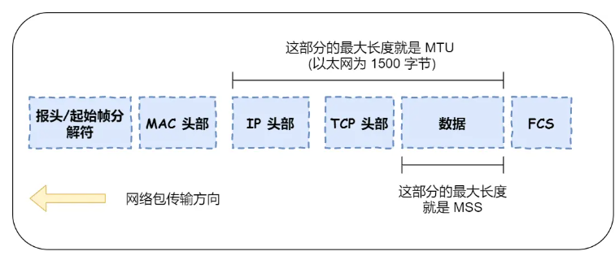
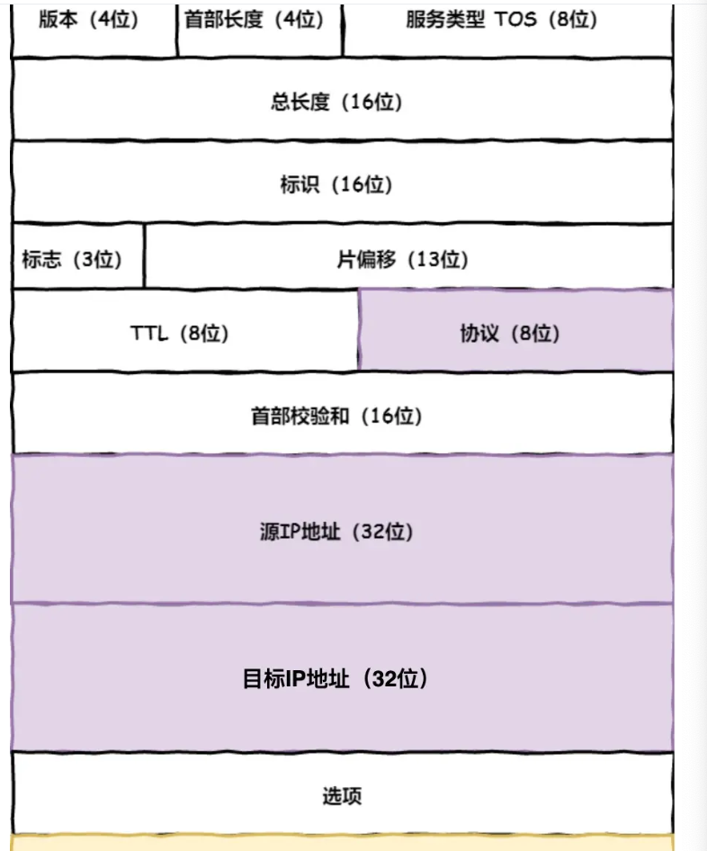
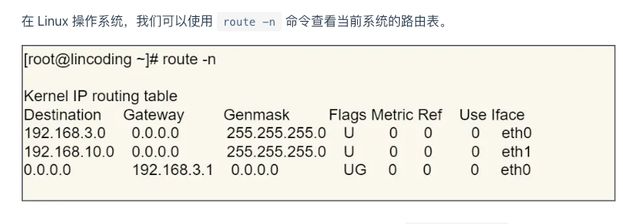
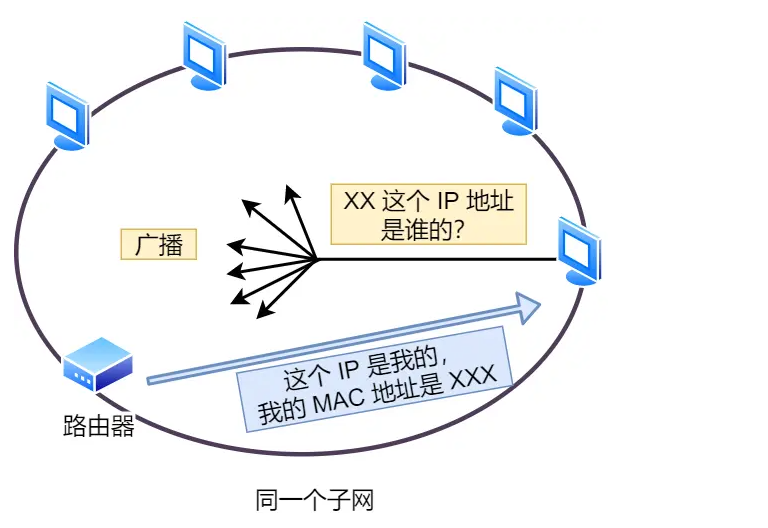

- #小林网络
- 从客户端键入网址,首先肯定要知道发到哪里去,分析域名,DNS服务查到对应ip和端口号,带上请求头和请求信息,经过层层加码,应用层,传输层加上tcp头,网络层加上ip地址,网络接口层加上mac地址,从网络中,经过路由器和交换器,一路缓过来,到了服务器端,再脱下层层,网络接口层到ip层到传输层到应用层,执行后端代码,把要显示的发回去,收到之后在页面上进行展示
- HTTP
	- 1. 浏览器解析URL URL由访问数据的协议+服务器名称+服务器上的文件路径组成
	- 2. 生成HTTP请求信息 请求行+请求头+消息体 响应的话是 状态行+消息头+消息体
	- 3. DNS 查询域名对应的IP地址
- DNS查询，www.server.com 根域为. 下面是.com是个树形的结构
	- 客户端发一个dns请求，发给本地的dns服务器，如果本地的dns能从缓存的表格里找到这个域名，就返回ip地址。
	- 如果本地没有，dns服务器去问他的根域名服务器，这个域名对应的ip地址，他会指名要去找哪个二级域名，然后一层一层找到对应的dns服务器，查询到对应的ip告诉本地dns服务器，将ip地址返回给客户端
	- 
	- 浏览器先看自己本身有没有这个域名的缓存，没有
		- 问操作系统，操作系统看缓存，没有
			- 问hosts文件，没有
				- 问本地DNS服务器，没有
					- 问根域名服务器，走上面的流程
- 协议栈
	- 4. 将http传输工作给操作系统的协议栈，应用层-传输层-网络层-网络接口层
	- 
	- 应用程序调用socket库，委托协议栈工作，上一半是tcpucp，下一半是ip，ip中包括ICMP告知网络包传送过程中产生的错误及各种控制信息，arp是根据ip地址找到mac地址。驱动程序控制网卡硬件，然后最下面的硬件网卡负责实际的收发操作
- TCP
	- 
	- 报文头
		- 源端口号（Source Port）：发送端应用程序的端口号。
		- 目的端口号（Destination Port）：接收端应用程序的端口号。
		- 序列号（Sequence Number）：用于数据重组的序列号。
		- 确认号（Acknowledgment Number）：当ACK标志位为1时，表示期望收到的下一个序列号。
		- 数据偏移（Data Offset）：TCP头的长度，即数据部分开始之前的位数。
		- 保留（Reserved）：保留未来使用，目前为0。
		- 控制位（Control Flags）：包含URG, ACK, PSH, RST, SYN, FIN等控制位。
			- syn发起一个连接
			- ack 回复
			- rst 重新连接
			- fin 结束连接
		- 窗口大小（Window Size）：控制接收端愿意接收的数据量，用于流量控制。
		- 校验和（Checksum）：用于错误检测的校验和。
		- 紧急指针（Urgent Pointer）：当URG标志位为1时，表示这个字段是有效的。
		- 选项（Options）：可选字段，用于各种TCP功能。
		- 数据（Data）：传输的实际数据。
	- 三次握手
		- 
		- 服务端一直处于监听的状态
		- 客户端发起连接，先给服务端发送个syn的消息，并且随机找个数据当做seq的数据，然后进入syn_sent的状态，去确认服务端是否可以接收数据
		- 服务端的端口监听到了这个请求连接，回复 syn+ack，表示是个回复且建立连接，ack的值是对应请求的seq+1，自己的 seq也是个随机的值，进入 syn_revd，确认客户端准备好接受数据了吗
		- 客户端收到后，返回ack，进入链接状态
	- tcp链接状态，netstat -napt
		- 
	- tcp分割数据
		- 
- IP
	- 报文头
		- 
		- IP里会存储源地址ip和目标地址IP，协议号填写06表示是TCP协议
		- 客户端一个电脑里可能会有多个网卡，每个网卡里对应一个IP，这里可以根据路由表来进行判断
			- 
			- 会依次和所有的条目进行计算，如果所有的都不匹配，会有个0.0.0.0的，他就是默认网关，兜底的IP规则
			- 如果匹配了，ip层会查看该路由关联的网络接口，通常就用接口上的IP来作为源IP地址，如果接口上配置了多个，就会选择住IP地址
			- 如果有具体的去处，就会distination的路由上跳转，如果没有，就去默认网关192.168.3.1
- MAC
	- 以太网使用的头部，包含接收方mac地址，发送方mac地址，协议类型
	- 协议类型包括IP协议，ARP协议。
	- 发送方的IP从网卡里获取，是网卡生产的时候就写到rom里的
	- 接收方的MAC地址，需要查询路由表，如果有匹配项gateway的地址为0.0.0.0 说明目的地的IP地址和自己是在同一个子网里，直接可达，不需要通过路由器，下一跳就是目的IP地址。如果匹配到默认网关，则发送方mac地址就是网关路由器的地址。
	- 确定了下一跳的地址，用arp讲下一跳ip地址解析成mac地址，是本地设备，询问ip地址设备的mac地址，如果是网关，询问网关mac地址。
	- ARP协议
		- 
		- 在以太网里广播，对所有设备询问，这个IP地址是谁的，对应的就会回应mac地址
		- 查询结果放到ARP缓存里，缓存时间是几分钟 查询缓存的命令  arp -a 会记录ip地址，mac地址，网口名称
- 网卡
	- 网卡驱动获取到网络包，复制到网卡的缓冲区中，在开头加上包头和起始帧分界符，在末尾加上用来检测错误的帧校验序列，转成电信号给发出去
- 交换机
	- 电信号到达网线接口，交换机接收
	- 将电信号转换成数字信号，通过FCS校验，没有问题就放到缓冲区，网卡有mac地址的话，会过滤下是不是发给我的，交换机没有mac地址，都会接受，查询包的接收方mac地址在地址表里吗？
	- 如果匹配到了，就发给那个端口
	- 如果匹配不到，就所有端口都发下，匹配不到可能是因为有这个地址的设备还没有给这个交换机发送过包
	- 如果接收方的mac地址是个广播地址，也会发给除了源端口之外的所有端口。
	- 广播地址
		- mac地址的FF:FF:FF:FF:FF:FF
		- IP地址的255.255.255.255
	- 地址表信息：
		- 设备的mac地址
		- 设备连在交换机哪个端口
- 路由器
	- 路由器的每个端口都有mac地址和ip地址
	- 接收发给自己的以太网包，通过路由表查询转发目标，由响应端口作为发送方把以太网包发送出去
	- 接收流程
		- 如果检测发送给自己的，放到缓冲区中
		- 去掉包开头的mac头部，根据IP地址里的信息通过路由表判断转发目标
	- 发送流程
		- 如果路由表里网关是ip地址，就是还要继续去路由器转发。如果网关为空，说明已经抵达终点了
		- 通过arp协议查询mac地址，也有arp缓存
		- 填写接收方的mac地址，输出端口的mac地址是发送方地址，协议写ip协议
		- 发送出去的网络包会通过交换机到达下一个路由器
- 到达服务器
	- 看mac头部，看是否和服务器自己的mac地址符合，符合就把包收起来
	- 然后看ip头，看ip地址符合，看协议像发现是tcp
	- tcp头，看序列号，看序列包是否是自己想要的，如果是，就返回一个ack，否则丢弃，看tcp里的端口号，找到对应的进程
	- 发给对应进程，看到请求是访问一个页面，就把网页封装在响应里，然后再传回去